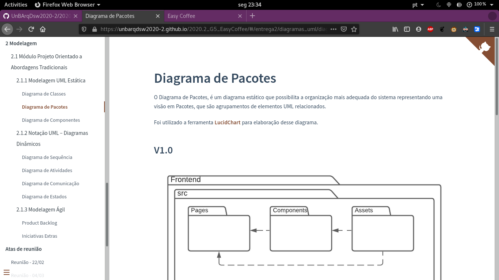
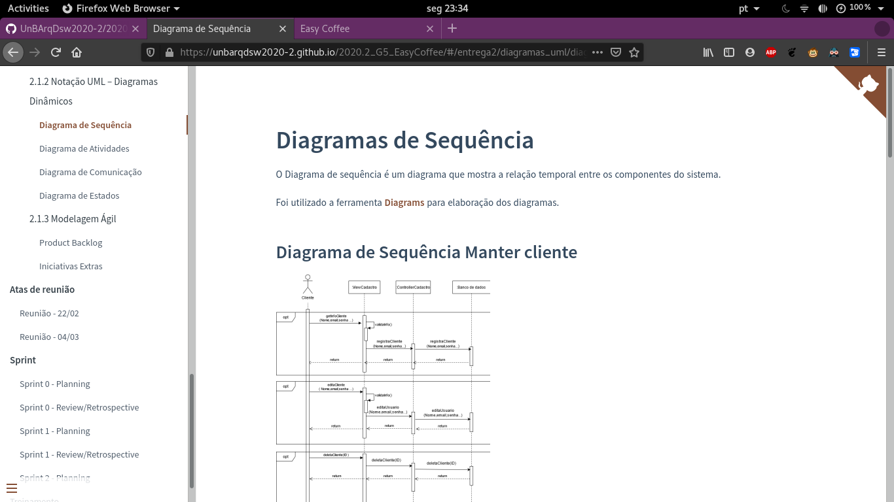

# Easy Coffee

**Código da Disciplina**: FGA0208 
**Número do Grupo**: 05 

## Alunos
|Matrícula | Aluno |
| -- | -- |
| 18/0015311  |  Danilo Domingo Vitoriano Silva  |
| 17/0011020  |  Gabrielle Ribeiro Gomes |
| 17/0034992  |  Gustavo Afonso Pires Severo |
| 16/0124751  |  Iago Theóphilo de Lima |
| 16/0125910  |  Itallo Gravina |
| 18/0023411  |  Maicon Lucas Mares de Souza |
| 15/0045182  |  Rafael Ribeiro de Oliveira |

## Sobre 
O projeto consiste em um site de uma cafeteria, onde os donos da cafeteria podem vender diversos produtos e os seus clientes podem realizar compras sem se deslocar até a cafeteria. Tendo em vista o âmbito de Transformação Digital, nossa solução visará resolver o problema de flexibilidade no acesso aos serviços/produtos da cafeteria.

## Screenshots Primeira Entrega

## Vídeo(s) Primeira Entrega

### Easy Coffee  | Módulo Projeto Não Orientado a Abordagens Específicas | 2º/2020
[Vídeo 1](https://www.youtube.com/embed/cVBDfov2Z8k)

### Easy Coffee | Módulo Processos/Metodologias/Abordagens | Arquitetura e Desenho de Software 2º/2020
[Vídeo 2](https://www.youtube.com/embed/9V6OZ4iW42g)

## Screenshots Segunda Entrega <<FOCO: DSW(Modelagem)>>

## Vídeo(s) Segunda Entrega <<FOCO: DSW(Modelagem)>>

### Easy Coffee  | Notação UML – Diagramas Estáticos
[Vídeo 1](https://www.youtube.com/watch?v=ZT_EMas2XfU)

### Easy Coffee  | Notação UML – Diagramas Dinâmicos 
[Vídeo 2](https://www.youtube.com/watch?v=gQrbI0ahZyA)

### Easy Coffee  | Modelagem Ágil | Backlog
[Vídeo 3](https://www.youtube.com/watch?v=oxgikbByJzM)

## Screenshots Terceira Entrega <<FOCO: DSW(Padrões de Projeto)>>
Adicione 2 ou mais screenshots do projeto em termos de artefatos da Terceira Entrega.

## Vídeo(s) Terceira Entrega <<FOCO: DSW(Padrões de Projeto)>>
Adicione o(s)s vídeo(s) da Terceira Entrega.

## Screenshots Quarta Entrega (FINAL) <<FOCOS: Arquitetura & Reutilização de Software & PROJETO FINAL>>
Adicione 2 ou mais screenshots do projeto em termos de interface e/ou funcionamento.

## Vídeo(s) Quarta Entrega (FINAL) <<FOCOS: Arquitetura & Reutilização de Software & PROJETO FINAL>>
Adicione o(s)s vídeo(s) da Entrega Final.

## Descritivo dos Principais Aspectos Técnicos 
**Principal(is) Metodologia(s) Adotada(s)**: xxxxxx 
**Principais Linguagens Utilizadas e/ou Pretendidas**: xxxxxx 
**Principais Tecnologias Utilizadas e/ou Pretendidas**: xxxxxx 
**Principal(is) Estilo(s) Arquitetural(is) Adotado(s)**: xxxxxx 

## O Projeto está rodando?
( ) SIM
( ) NÃO
Se SIM, insira um manual (ou um script) para auxiliar ainda mais os interessados em consultar o projeto.

## Informações Complementares 
Quaisquer outras informações sobre seu projeto podem ser descritas nessa seção.
