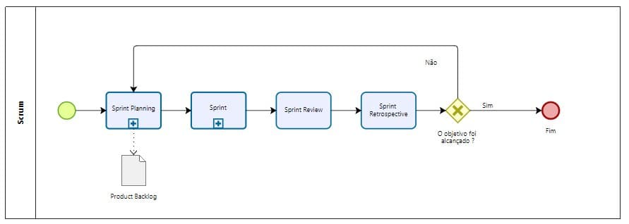
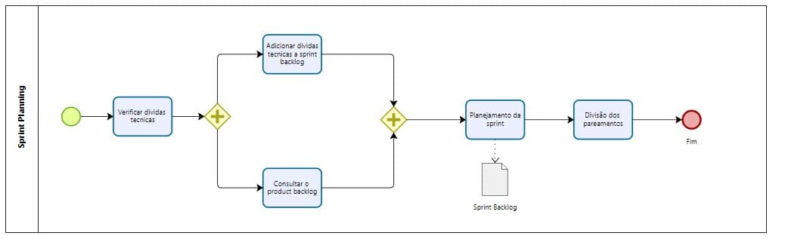
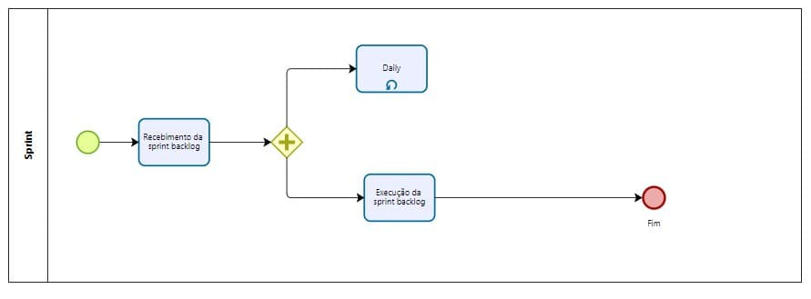

## Modelagem BPMN
"A modelagem de processos é a representação gráfica dos processos de uma empresa. Fazer essa diagramação é muito importante porque permite a leitura do funcionamento da empresa e o entendimento de como a organização gera valor aos clientes. Para facilitar a modelagem de processos é possível contar com um conjunto padronizado de símbolos e regras, e o mais indicado deles é a Notação BPMN". (ALMEIDA,Vinicius, 2017).

É importante ressaltar que a construção do diagrama levou em conta a metodologia híbrida documentada [aqui](/entrega1/metodologia.md).

## Processos do projeto
### Scrum

### Sprint Planning

#### Sprint

## Referências

SERRANO, Milene. BPMN, 2021. Vídeo-aulas complementares apresentadas na Disciplina de Arquitetura e Desenho de Software do curso de engenharia de software da UnB, FGA. Acesso em: 19 de fevereiro de 2021.

EUAX CONSULTING. O que é BPMN (Business Process Model and Notation) e como aplicar essa notação na Modelagem de Processos. Disponível em: https://www.euax.com.br/2017/02/o-que-e-bpmn-business-process-model-and-notation/. Acesso em 19 de fevereiro de 2021

## Versionamento

| Data | Versão | Descrição | Autor(es) |
|------|------|------|------|
|19/02/2021|1.0| Criação do BPMN | [Iago Theóphilo](https://github.com/IagoTheophilo),  [Itallo Gravina](https://github.com/itallogravina) e [Maicon Mares](https://github.com/MaiconMares),|