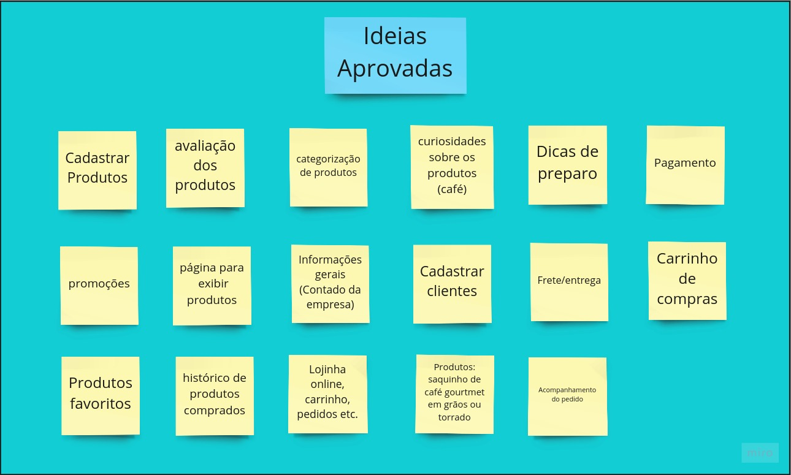
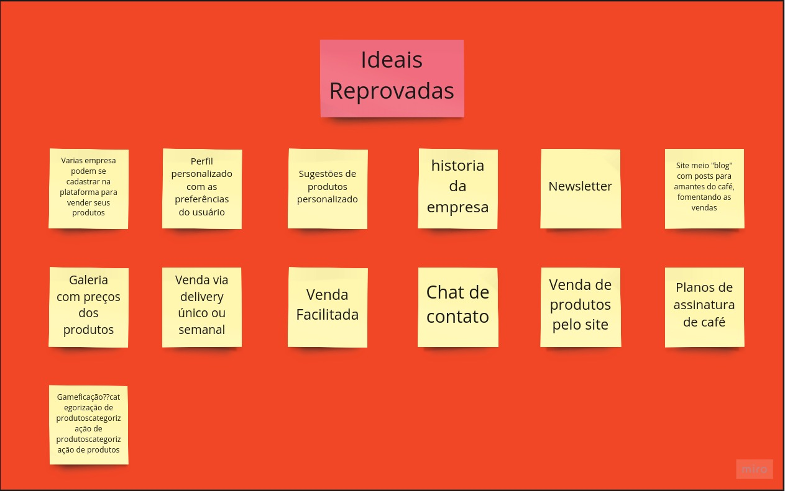

# Brainstorm

O brainstorm é uma atividade que propõe explorar as idéias dos integrantes de um grupo, a proposta é dar liberdade para todos proporem soluções, idéias, conceitos e comentários a respeito de algum tema em específico, a idéia por trás da técnica e obter várias perspectivas a respeito de um assunto.

Para o nosso brainstorm os membros do grupo se reuniram em uma videochamada para conversar e a plataforma Miro para listar todas as idéias em um quadro em branco por meio de post-its, depois disso as idéias foram discutidas e categorizadas em 2 quadros de aprovação ou reprovação. 

## Quadro de ideias aprovadas

## Quadro de ideias reprovadas

## Referência Bibliográficas

- BRAINSTORMING. In: WIKIPÉDIA: a enciclopédia livre. Wikimedia, 2021. Disponível em: https://pt.wikipedia.org/wiki/Brainstorming. Acesso em: 16 fev. 2021.

## Versionamento

| Data | Versão | Descrição | Autor(es) |
|------|------|------|------|
|15/02/2021|1.0|Adicionando brainstorm|[Danilo Domingo](https://github.com/danilow200), [Gabrielle Ribeiro](https://github.com/Gabrielle-Ribeiro), [Gustavo Afonso](https://github.com/GustavoAPS), [Iago Theóphilo](https://github.com/IagoTheophilo), [Itallo Gravina](https://github.com/itallogravina), [Maicon Mares](https://github.com/MaiconMares), [Rafael Ribeiro](https://github.com/rafaelflarrn)|