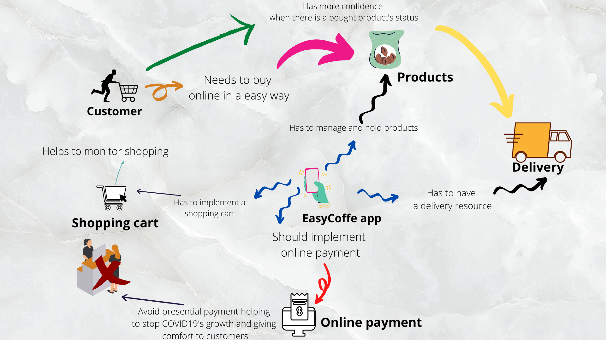
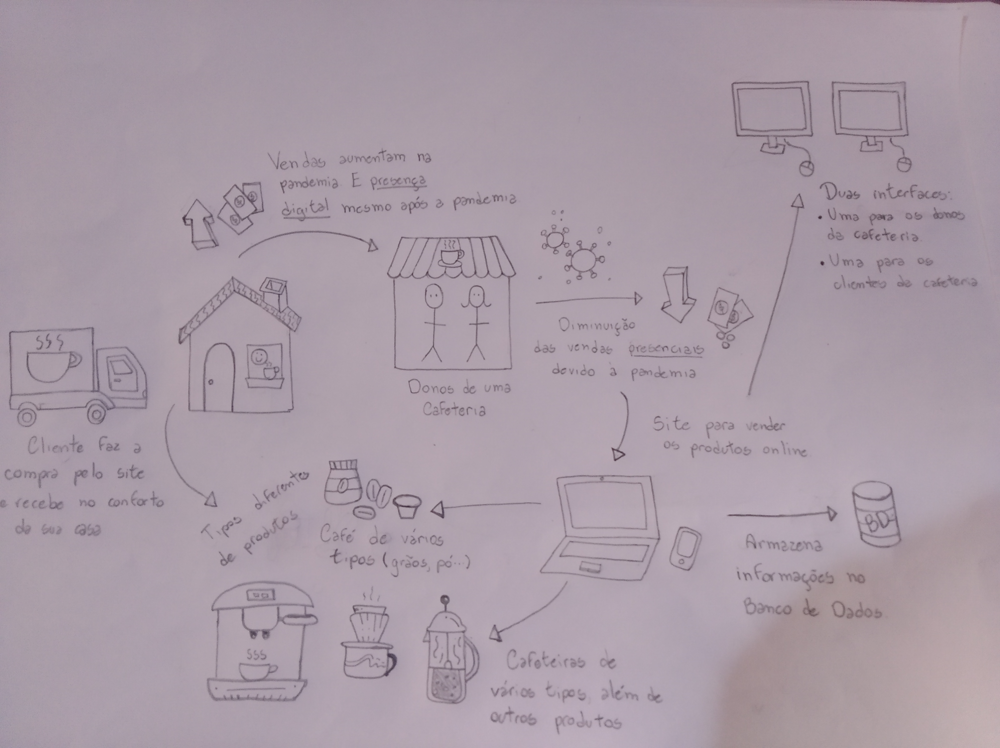
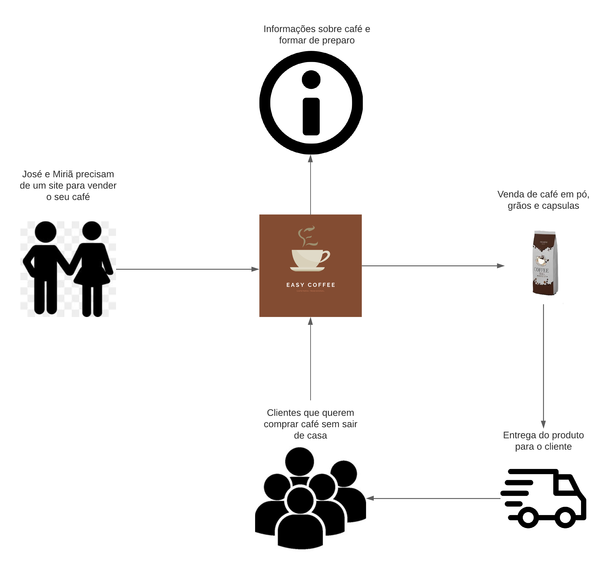
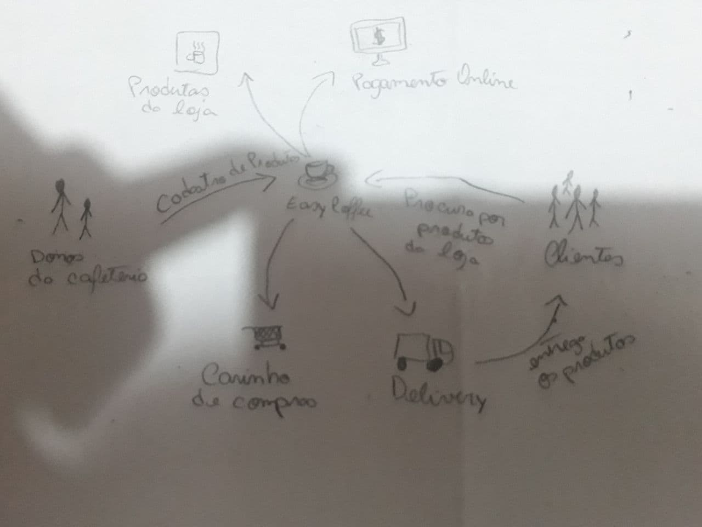
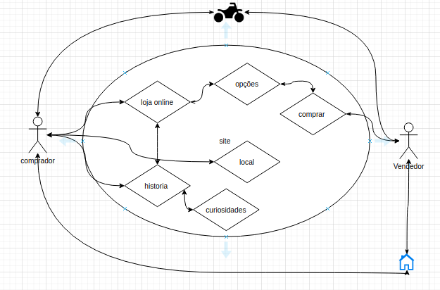
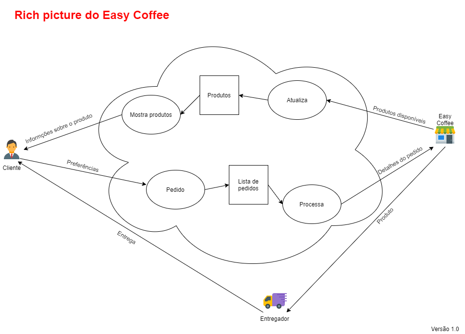

# Rich Picture

A rich picture é uma representação que usa desenhos, textos, símbolos, figuras e tudo mais que possa graficamente ajudar a compreender o contexto em que a solução de software vai estar inserida, uma rich picture mostra a estrutura de um problema e faz conexões entre vários elementos ali representados.   

## Rich Picture 1.0

### Rich pictures individuais

Autoria: [Maicon Mares](https://github.com/MaiconMares)

Autoria: [Gabrielle Ribeiro](https://github.com/Gabrielle-Ribeiro)

Autoria: [Danilo Domingo](https://github.com/danilow200)

Autoria: [Gustavo Afonso](https://github.com/GustavoAPS)

Autoria: [Iago Theóphilo](https://github.com/IagoTheophilo)

Autoria: [Itallo Gravina](https://github.com/itallogravina)

Autoria: [Rafael Ribeiro](https://github.com/rafaelflarrn)

## Referência Bibliográficas

Communicative Art, The Art of Rich Pictures. Disponível em: https://www.youtube.com/watch?v=8ZH-NKqKF9A. Acesso em: 16 fev. 2021.

## Versionamento

| Data | Versão | Descrição | Autor(es) |
|------|------|------|------|
|17/02/2021|1.0|Adicionando Rich Picture|[Danilo Domingo](https://github.com/danilow200), [Gabrielle Ribeiro](https://github.com/Gabrielle-Ribeiro), [Gustavo Afonso](https://github.com/GustavoAPS), [Iago Theóphilo](https://github.com/IagoTheophilo), [Itallo Gravina](https://github.com/itallogravina), [Maicon Mares](https://github.com/MaiconMares), [Rafael Ribeiro](https://github.com/rafaelflarrn)|