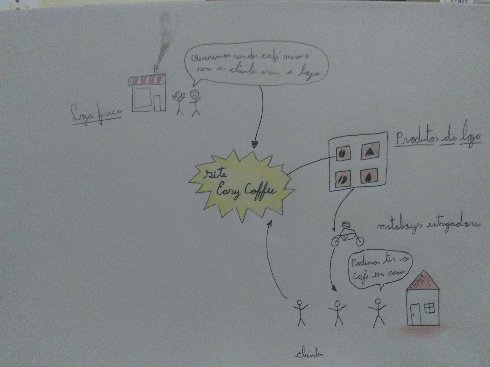

# Rich Picture

A rich picture é uma representação que usa desenhos, textos, símbolos, figuras e tudo mais que possa graficamente ajudar a compreender o contexto em que a solução de software vai estar inserida, uma rich picture mostra a estrutura de um problema e faz conexões entre vários elementos ali representados.   

## Rich Picture 1.0

### Rich pictures individuais

Autoria: [Maicon Mares](https://github.com/MaiconMares)

Autoria: [Gabrielle Ribeiro](https://github.com/Gabrielle-Ribeiro)

Autoria: [Danilo Domingo](https://github.com/danilow200)

Autoria: [Gustavo Afonso](https://github.com/GustavoAPS)

Autoria: [Iago Theóphilo](https://github.com/IagoTheophilo)

Autoria: [Itallo Gravina](https://github.com/itallogravina)

Autoria: [Rafael Ribeiro](https://github.com/rafaelflarrn)

