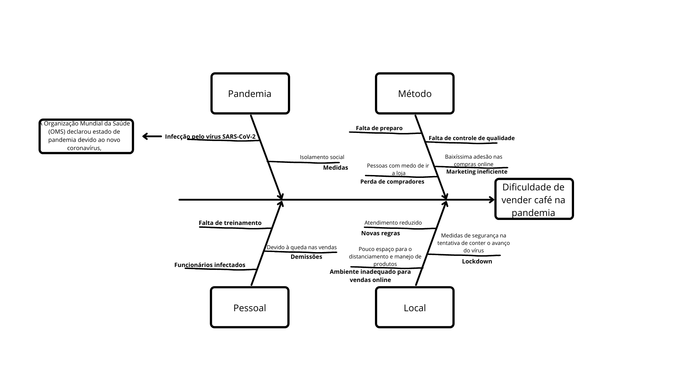

# Diagrama de Ishikawa

## Introdução

O Diagrama de Ishikawa, também conhecido como Diagrama de Causa e Efeito ou Diagrama de Espinha de peixe, apresenta a relação existente entre o resultado indesejado ou não conforme de um processo(efeito) e os diversos fatores(causas) que podem contribuir para que esse resultado tenha ocorrido.

É possível aplicar o Diagrama de Ishikawa a diversos contextos e de diferentes maneiras, entre elas:

- Para visualizar as causas principais e secundárias de um problema(efeito);
- Para ampliar a visão das possíveis causas de um problema, enxergando-o de maneira mais sistêmica e abrangente;
- Para identificar soluções, levantando os recursos disponíveis pela empresa;
- Para gerar melhorias nos processos.

    
     
    <i>Diagrama de Ishikawa</i>

## Referência Bibliográficas
- Diagrama de Ishikawa. Disponível em: https://blogdaqualidade.com.br/diagrama-de-ishikawa. Acesso em: 16 fev 2021.
- Diagrama de Ishikawa. Disponível em: https://pt.wikipedia.org/wiki/Diagrama_de_Ishikawa. Acesso em: 17 fev 2021.

## Versionamento

| Data | Versão | Descrição | Autor(es) |
|------|------|------|------|
|17/02/2021|1.0|Criando a primeira versão do Diagrama de Ishikawa|[Rafael Ribeiro](https://github.com/rafaelflarrn)|