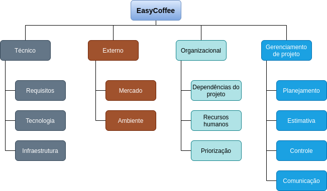

# Plano de Gerenciamento de Riscos

## Introdução

Esse documento tem como objetivo planejar como o gerenciamento dos riscos será executado, monitorado e controlado. Risco pode ser definido como “evento ou condição incerta que, se ocorrer, terá um efeito positivo ou negativo sobre pelo menos um objetivo do projeto” (PMBOK, 2004). Logo, temos riscos negativos (afetam objetivos) e riscos positivos (oportunidade que se ocorrer beneficiará o projeto). Para gerenciamento dos riscos (identificar, manter e controlar) as seguintes etapas fazem-se necessárias: identificação dos riscos, análise qualitativa, análise quantitativa, respostas aos riscos e monitoramento.

## Estrutura Analítica de Riscos (EAR)

Por meio do diagrama a seguir podemos definir os riscos que podem afetar o projeto em quatro categorias gerais: Técnico, Externo, Organizacional e Gerenciamento de projeto.

    
    <i>Estrutura Analítica de Riscos - EasyCoffee</i>

## Versionamento

<table>
<tr>
    <th>Data</th>
    <th>Descrição</th>
    <th>Versão</th>
    <th>Autor(es)</th>
</tr>
<tr>
    <td>16/02/2021</td>
    <td>
Plano de Riscos inicial

</td>
    <td>
1.0

</td>
    <td>Maicon Mares</td>
</tr>
</table>
