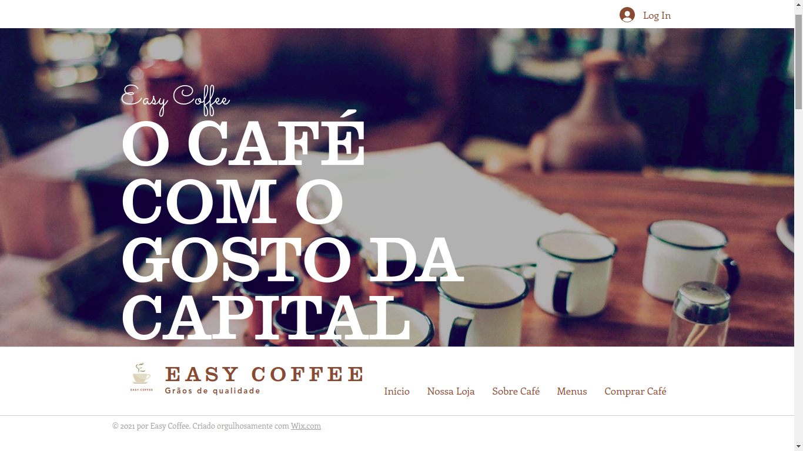
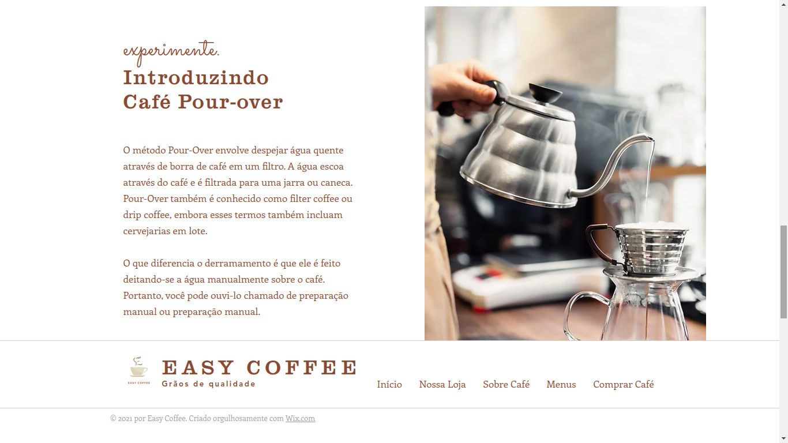
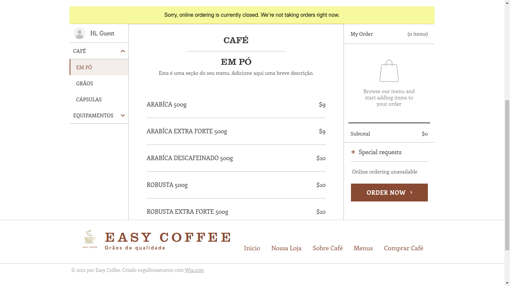
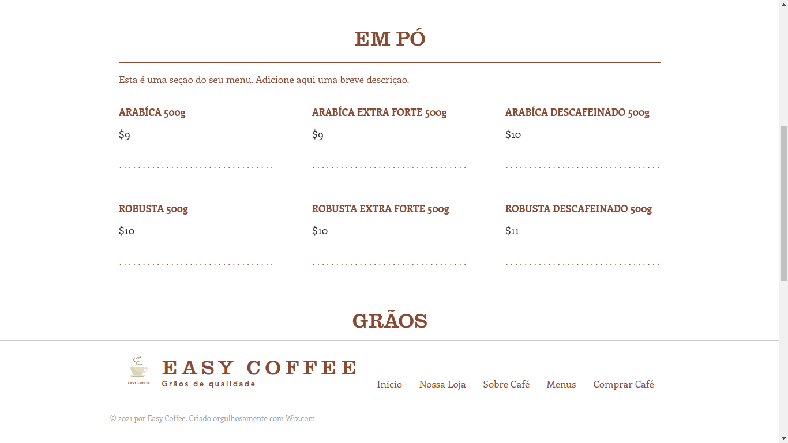
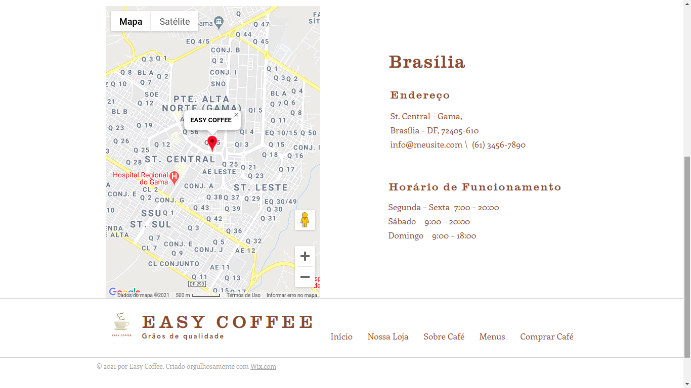

# Protótipo de Alta Fidelidade

O protótipo de alta fidelidade foi feito tendo em vista as decisões tomadas na guia de estilo e nos requisitos elicitados durante o design sprint, a idéia desse protótipo é representar com precisão o que se espera do produto final.

Para o montagem do protótipo foi usada a ferramenta de protitipagem do wix, o que nos permitiu adicionar elementos interativos como botões, campos de texto e algumas animações simples.

Caso nosso projeto estivesse em desenvolvimento junto a um cliente real, esse protótipo seria apresentado para validação, o que no nosso caso foi feito internamente entre os membros do grupo, essa é a etapa de test dentro do design sprint.
 

## Versão 1.0 - Protótipo

Protótipo disponível em: https://trabalhofga123.wixsite.com/easycoffee

### 1.2. Telas protótipo

# Versão 2.0 - Protótipo

Foi alterado a ferramenta de protótipação para o [Figma](https://www.figma.com/). Tendo em vista, que a ferramenta facilitária o processo de protótipação.

Click [aqui](https://www.figma.com/file/KYSzVKaKD3ONJ1wgwUz6XZ/EasyCoffee?node-id=0%3A1) para ver o projeto ou interaja com o protótipo abaixo.

<iframe style="border: 1px solid rgba(0, 0, 0, 0.1);" width="800" height="450" src="https://www.figma.com/embed?embed_host=share&url=https%3A%2F%2Fwww.figma.com%2Fproto%2FKYSzVKaKD3ONJ1wgwUz6XZ%2FEasyCoffee%3Fnode-id%3D21%253A0%26scaling%3Dmin-zoom" allowfullscreen></iframe>

## Referência Bibliográficas

MACEDO, Gabriel. 10 heurísticas de Nilsen para o design de interface. 2 de agosto de 2017. Disponível em: https://brasil.uxdesign.cc/10-heur%C3%ADsticas-de-nielsen-para-o-design-de-interface-58d782821840?gi=8d22872687c5. Acesso em: 16 fev 2021.

## Versionamento

| Data | Versão | Descrição | Autor(es) |
|------|------|------|------|
|16/02/2021|1.0|Adicionando primeira versão do protótipo|[Gustavo Afonso](https://github.com/GustavoAPS) e [Danilo Domingo](https://github.com/danilow200)|
|16/02/2021|1.1|Adicionando Bibliográfia e imagens|[Gustavo Afonso](https://github.com/GustavoAPS)|
|07/03/2021|2.0| Alteração do protótipo para o figma - Versão 2.0|[Iago Theóphilo](https://github.com/iagotheophilo) e [Itallo Gravina](https://github.com/itallogravina)|