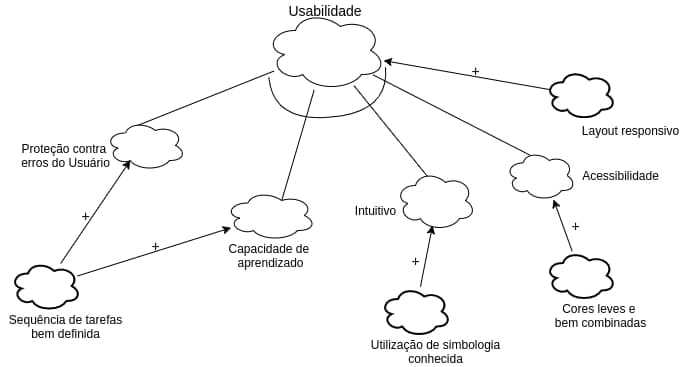
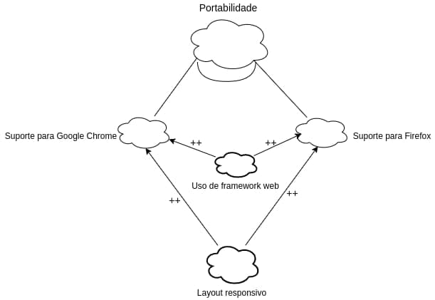
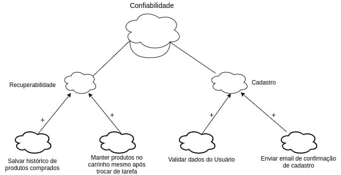
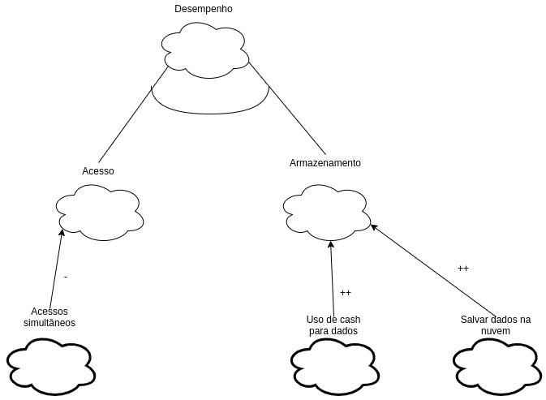

# Requisitos Não Funcionais

## Introdução
O grupo decidiu trabalhar com o framework NFR para trazer mais confiabilidade no levantamento de requisitos não funcionais.

## NFR Framework

 "O NFR Framework é uma abordagem para representar e analisar Requisitos Não-Funcionais. Seu objetivo é ajudar desenvolvedores na implementação de soluções personalizadas, levando em consideração as características do domínio e do sistema em questão. Tais características incluem Requisitos Não-funcionais, Requisitos funcionais, prioridades e carga de trabalho. Esses fatores determinam a escolha de alternativas de desenvolvimento para um determinado sistema (CHUNG et al., 2000)" (SILVA, 2019, p. 31).

## Usabilidade

## Usabilidade(propagação)
.png)

## Portabilidade 

## Portabilidade(propagação)
.png)

## Segurança

## Segurança(propagação)
.png)

## Confiabilidade

## Confiabilidade(propagação)
.png)

## Desempenho

## Desempenho(propagação)
.jpg)

## Requisitos Não Funcionais

<table>
    <tr>
        <th>
            Requisitos
        </th>
        <th>
            Descrição
        </th>
        <th>
            Classificação
        </th>
    </tr>
    <tr>
        <td>
            RNF01
        </td>
        <td>
            A interface deve ser agradável e de fácil utilização.
        </td>
        <td>
            Usabilidade
        </td>
    </tr>
    <tr>
        <td>
            RNF02
        </td>
        <td>
            O site não deverá armazenar dados localmente, sendo estes direcionados a um servidor externo.
        </td>
        <td>
            Performance
        </td>
    </tr>
    <tr>
        <td>
            RNF03
        </td>
        <td>
            As cores dos elementos de cada categoria devem possuir cores próximas para garantir uma melhor compreensão pelo usuário.
        </td>
        <td>
            Usabilidade
        </td>
    </tr>
    <tr>
        <td>
            RNF04
        </td>
        <td>
            O usuário deve ser capaz de criar login e senha para acessar o sistema
        </td>
        <td>
            Confiabilidade
        </td>
    </tr>
    <tr>
        <td>
            RNF05
        </td>
        <td>
            O sistema deve ser capaz de diferenciar o Usuário do Administrador.
        </td>
        <td>
            Segurança
        </td>
    </tr>
    <tr>
        <td>
            RNF06
        </td>
        <td>
            O sistema deve ser capaz de listar os itens de forma ágil e fácil de compreender
        </td>
        <td>
            Performance
        </td>
    </tr>
    <tr>
        <td>
            RNF07
        </td>
        <td>
            O sistema deverá ter alta disponibilidade, p.exemplo, 99% do tempo.
        </td>
        <td>
            Usabilidade
        </td>
    </tr>
    <tr>
        <td>
            RNF08
        </td>
        <td>
            O sistema deverá executar em qualquer navegador.
        </td>
        <td>
            Portabilidade
        </td>
    </tr>
    <tr>
        <td>
            RNF09
        </td>
        <td>
            O sistema deverá se comunicar com o banco MongoDB
        </td>
        <td>
            Suportabilidade
        </td>
    </tr>
    <tr>
        <td>
            RNF10
        </td>
        <td>
            o sistema não apresentará aos usuários quaisquer dados de cunho privativo
        </td>
        <td>
            Segurança
        </td>
    </tr>
    <tr>
        <td>
            RNF11
        </td>
        <td>
            o sistema deverá atender às normas legais, tais como padrões, leis, etc.
        </td>
        <td>
            Regulatório
        </td>
    </tr>
    <tr>
        <td>
            RNF12
        </td>
        <td>
            O sistema deverá suportar uma carga máxima de 2000 usuários simultâneos com degradação de desempenho de, no máximo, 10% em qualquer operação
        </td>
        <td>
            Performance
        </td>
    </tr>
    <tr>
        <td>
            RNF13
        </td>
        <td>
            Um novo usuário deverá ser capaz de fazer um pedido de compra de um novo produto
        </td>
        <td>
            Usabilidade
        </td>
    </tr>
    <tr>
        <td>
            RNF14
        </td>
        <td>
            O sistema deverá ser acessado completamente via browser HTTP/HTML
        </td>
        <td>
            Suportabilidade
        </td>
    </tr>
</table>

## Versionamento
| Data | Versão | Descrição | Autor(es) |
|------|------|------|------|
|08/03/2021|1.0| Criação do requistos não funcionais e NFRs| [Iago Theóphilo](https://github.com/IagoTheophilo), [Itallo Gravina](https://github.com/itallogravina) e [Maicon Mares](https://github.com/MaiconMares)|
|08/03/2021|1.1|Correção da tabela e ortografia| [Maicon Mares](https://github.com/MaiconMares)
|08/03/2021|1.2| Adição dos diagramas de propagação| [Iago Theóphilo](https://github.com/IagoTheophilo), [Itallo Gravina](https://github.com/itallogravina) e [Maicon Mares](https://github.com/MaiconMares)|
