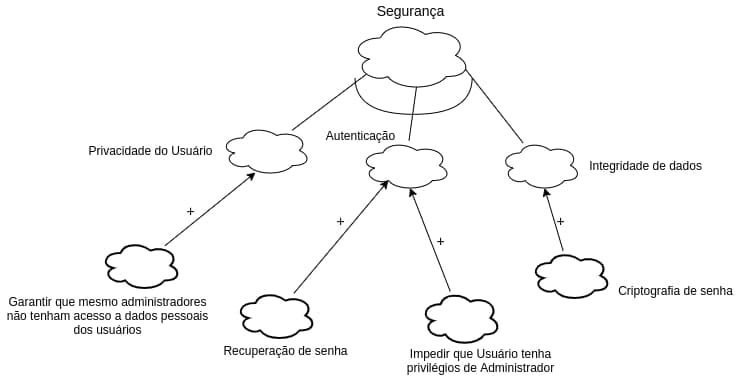

# Requisitos Não Funcionais

## Introdução
O grupo decidiu trabalhar com o framework NFR para trazer mais confiabilidade no levantamento de requisitos não funcionais.

## NFR Framework

 "O NFR Framework é uma abordagem para representar e analisar Requisitos Não-Funcionais. Seu objetivo é ajudar desenvolvedores na implementação de soluções personalizadas, levando em consideração as características do domínio e do sistema em questão. Tais características incluem Requisitos Não-funcionais, Requisitos funcionais, prioridades e carga de trabalho. Esses fatores determinam a escolha de alternativas de desenvolvimento para um determinado sistema (CHUNG et al., 2000)" (SILVA, 2019, p. 31).

## Usabilidade

## Portabilidade 

## Segurança

## Confiabilidade

## Desempenho

## Requisitos Não Funcionais

|Requisitos| Descrição|Classificação|
|---|---|---|
|RNF01|A interface deve ser agradável e de fácil utilização.| Usabilidade|
|RNF02|O site não deverá armazenar dados localmente, sendo estes direcionados a um servidor externo.| Performance|
|RNF03|As cores dos elementos de cada categoria devem possuir cores próximas para garantir uma melhor compreensão pelo usuário.|Usabilidade |
|RNF04|O usuário deve ser capaz de criar login e senha para acessar o sistema|Confiabilidade |
|RNF05|o sistema deve ser capaz de diferenciar o Usuário do adm |Segurança |
|RNF06|O sistema deve ser capaz de listar os itens de forma ágil e fácil de compreender |Performance |
|RNF07|o sistema deverá ter alta disponibilidade, p.exemplo, 99% do tempo.|Usabilidade|
|RNF08|o sistema deverá executar em qualquer navegador.|Portabilidade|
|RNF09|o sistema deverá se comunicar com o banco MongoDB|Suportabilidade |
|RNF10|o sistema não apresentará aos usuários quaisquer dados de cunho privativo|Segurança |
|RNF11|o sistema deverá atender às normas legais, tais como padrões, leis, etc.|Regulatório |
|RNF12|O sistema deverá suportar uma carga máxima de 2000 usuários simultâneos com degradação de desempenho de, no máximo, 10% em qualquer operação|Performance |
|RNF13|Um novo usuário deverá ser capaz de fazer um pedido de compra de um novo produto|Usabilidade |
|RNF14|O sistema deverá ser acessado completamente via browser HTTP/HTML|Suportabilidade |

## Referências Bibliográficas

CASTRO, Jaelson. Requisitos Não-Funcionais. Disponível em: https://www.cin.ufpe.br/~if716/arquivos20152/experimentoBruno/Aula2/Aula2-Parte2-NFR%20Framework.pdf. Acesso em: 08 de março de 2021.

## Versionamentofile
| Data | Versão | Descrição | Autor(es) |
|------|------|------|------|
|08/03/2021|1.0| Criação do requistos não funcionais e NFRs| [Iago Theóphilo](https://github.com/IagoTheophilo), [Itallo Gravina](https://github.com/itallogravina) e [Maicon Mares](https://github.com/MaiconMares)|
|08/03/2021|1.1| Revisão de documento | [Gabrielle Ribeiro](https://github.com/Gabrielle-Ribeiro) |
