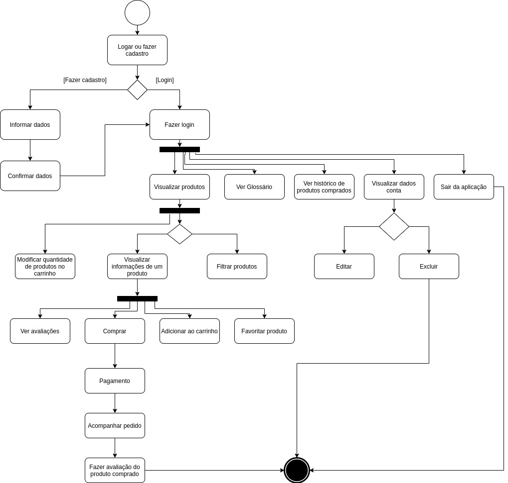
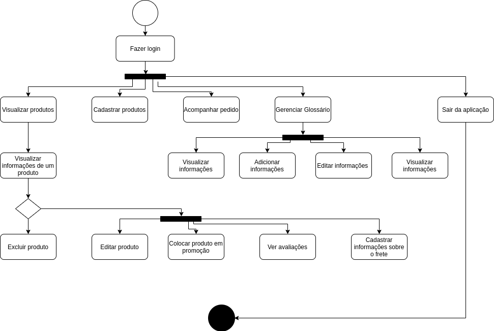

# Diagrama de atividades

O Diagrama de Atividades é um diagrama dinâmico que foca em representar o fluxo entre os objetos, ou seja, o ponto de vista comportamental. Dá atenção aos processos de negócio, fluxo de trabalho e procedimentos.

## Cliente (V1.0)

<i>Feito por: Maicon Mares</i>

## Administrador (V1.0)

<i>Feito por: Maicon Mares</i>

## Versionamento

| Data | Versão | Descrição | Autor(es) |
|------|------|------|------|
|27/02/2021|1.0|Criação do Diagrama de Atividades do Cliente|[Maicon Mares](https://github.com/MaiconMares)|
|27/02/2021|1.0|Criação do Diagrama de Atividades do Administrador|[Maicon Mares](https://github.com/MaiconMares)|