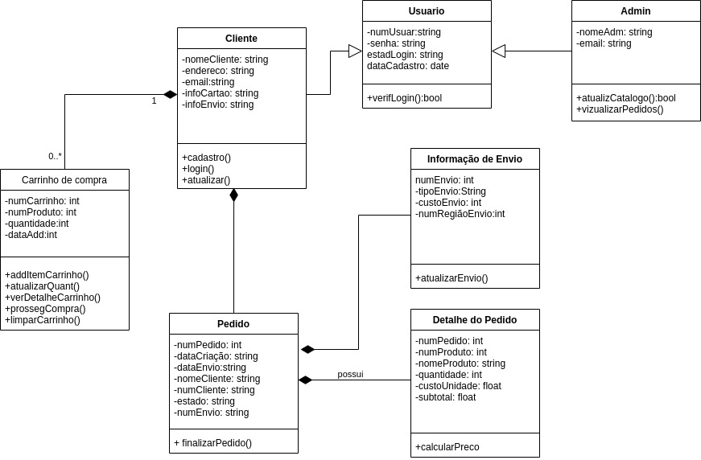

# Diagrama de Classes

A Linguagem de modelagem unificada (UML) nos ajuda a modelar sistemas de diversas maneiras. Um dos tipos mais populares na UML é o diagrama de classes. Bastante usado por engenheiros de software para documentar arquiteturas de software, os diagramas de classes são um tipo de diagrama de estrutura porque descrevem o que deve estar presente no sistema a ser modelado.

A UML foi criada como um modelo padronizado para descrever uma abordagem de programação orientada ao objeto. Como as classes são os componentes básicos dos objetos, diagramas de classes são os componentes básicos da UML. Os diversos componentes em um diagrama de classes podem representar as classes que serão realmente programadas, os principais objetos ou as interações entre classes e objetos.

## Diagrama de Classes - V1.0

## Diagrama de Classes - V0.1

## Referências Bibliográficas
 
[Referencia 1](https://github.com/UnBArqDsw/2020.1_G12_Stock)
[Referencia 2](https://creately.com/blog/pt/diagrama/tutorial-diagrama-de-classes/)

## Versionamento

| Data | Versão | Descrição | Autor(es) |
|:----:|:------:|:---------:|:---------:|
|24/02/2021|0.1|Criação do diagrama de classes|[Itallo Gravina](https://github.com/itallogravina)|
|08/03/2021|1.0|Melhoria no diagrama de classes|[Danilo Domingo](https://github.com/danilow200), [Gabrielle Ribeiro](https://github.com/Gabrielle-Ribeiro), [Gustavo Afonso](https://github.com/GustavoAPS)|
