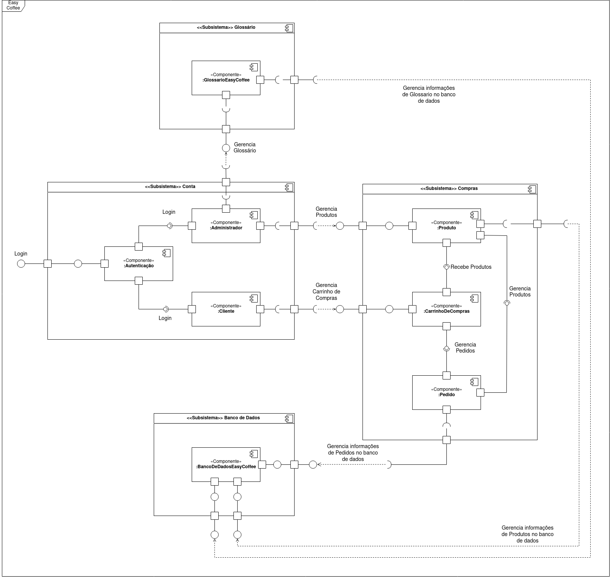

# Diagrama de Componentes

O diagrama de Componentes é um tipo de diagrama UML que serve para mostrar as relações estruturais entre os componentes de um sistema. Isso ajuda na modularização do systema e favorece a reutilização dos mesmos.

## Diagrama de Componentes Easy Coffee - V 1.0

## Referências Bibliográficas

Component Diagram Tutorial. Disponível em: https://online.visual-paradigm.com/diagrams/tutorials/component-diagram-tutorial/. Acesso em: 05 de março de 2021.

UML Componet Diagrams. Disponível em: https://www.uml-diagrams.org/component-diagrams.html. Acesso em: 05 de março de 2021.

## Versionamento

|Data | Versão | Descrição | Autor(es)|
|-----|--------|-----------|----------|
|05/03/2021| 1.0 | Adicionando Diagrama de Componentes V 1.0 | [Gabrielle Ribeiro](https://github.com/Gabrielle-Ribeiro) |
