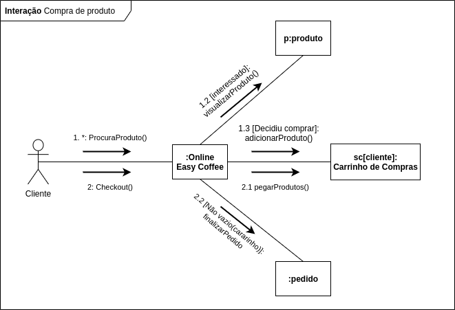

# Diagrama de Comunicação

O Diagrama de Comunicação é um tipo de diagrama de interação UML que mostra interações entre objetos e/ou partes(representadas pelas lifelines) usando mensagens sequenciadas em um arranjo de forma livre.

## Diagrama de Comunicação Cliente - V 1.0

<i>Feito por: Rafael Ribeiro</i>

- UML-DIAGRAMS. UML Communication Diagrams Overview; Disponível em: https://www.uml-diagrams.org/activity-diagrams.html. Acesso em: 07 de março de 2021.

## Versionamento

| Data | Versão | Descrição | Autor(es) |
|------|------|------|------|
|07/03/2021|1.0|Criação do Diagrama de Comunicação do Cliente|[Rafael Ribeiro](https://github.com/rafaelflarrn)|