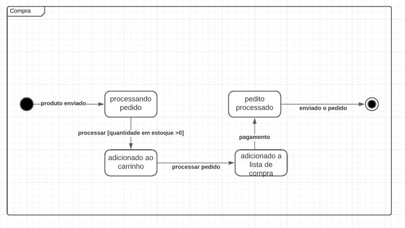

# Diagrama de Estados

O diagrama de estados é um tipo de diagrama de comportamento na Unified Modeling Language (UML), que representa a transformação entre vários objetos. A máquina de estado serve para descrever objetos que têm um comportamento complicado ou significativo.Podemos usar o diagrama para classes, componentes e operações. 

Com o objetivo de trazer maior qualidade ao projeto, utilizaremos o diagrama apenas para represetar a operação mais significativa para a regra de negócio, a operação de compra.

Foi utilizado a ferramenta [LucidHart](https://www.lucidchart.com) para elaboração desse diagrama.

## V1.0

Feito por: [Iago Theóphilo](https://github.com/iagotheophilo)

## Referência Bibliográficas
 - https://www.lucidchart.com/pages/pt/o-que-e-diagrama-de-maquina-de-estados-uml. Acesso em: 25 fev. 2021.
 - UML. State Machine Diagrams. [S. l.], 2020. Disponível em: https://www.uml-diagrams.org/state-machine-diagrams.html. Acesso em: 26 fev. 2021.
 - Unified Modeling Language (UML) | State Diagrams. Disponível em: https://www.geeksforgeeks.org/unified-modeling-language-uml-state-diagrams/. Acesso em: 26 fev. 2021.
 - Creating state machine diagrams. Disponível em: https://www.ibm.com/support/knowledgecenter/en/SS8PJ7_9.7.0/com.ibm.xtools.modeler.doc/topics/twrksmd.html. Acesso em: 26 fev. 2021.

## Versionamento

| Data | Versão | Descrição | Autor(es) |
|------|------|------|------|
|26/02/2021|1.0|Criando e adicionando a V1.0 do diagrama|[Iago Theóphilo](https://github.com/iagotheophilo)|