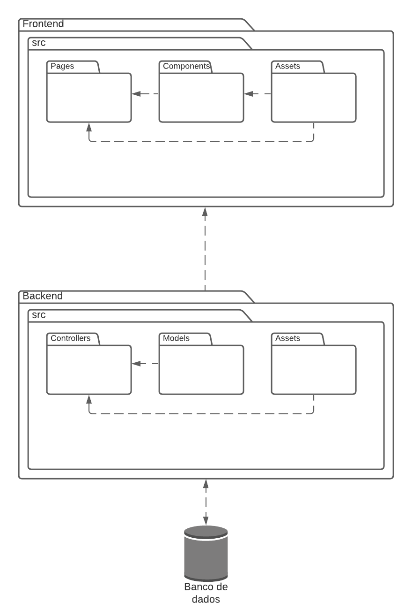

# Diagrama de Pacotes

O Diagrama de Pacotes, é um diagrama estático que possibilita a organização mais adequada do sistema representando uma visão em Pacotes, que são agrupamentos de elementos UML relacionados.

Foi utilizado a ferramenta [LucidChart](https://www.lucidchart.com) para elaboração desse diagrama.

## V1.0

Feito por: [Danilo Domingo](https://github.com/danilow200)

## Referência Bibliográficas
 - https://www.uml-diagrams.org/package-diagrams-overview.html. Acesso em: 25 fev. 2021.

## Versionamento

| Data | Versão | Descrição | Autor(es) |
|------|------|------|------|
|25/02/2021|1.0|Criando e adicionando a V1.0 do diagrama|[Danilo Domingo](https://github.com/danilow200)|
