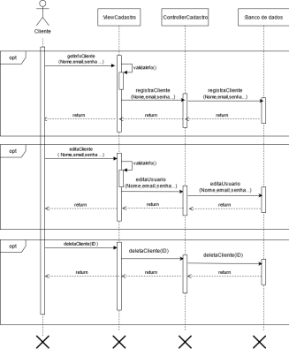
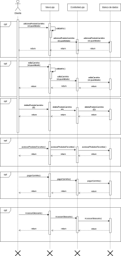
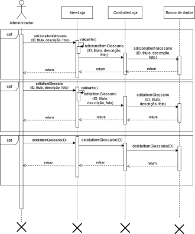
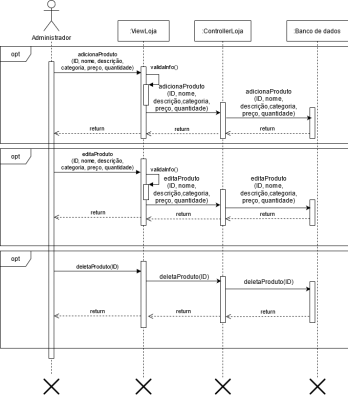

# Diagramas de Sequência

O Diagrama de sequência é um diagrama que mostra a relação temporal entre os componentes do sistema.

Foi utilizado a ferramenta [Diagrams](www.diagrams.net) para elaboração dos diagramas.

## Diagrama de Sequência Manter cliente

Feito por: [Gustavo Afonso](https://github.com/GustavoAPS)

## Diagrama de Sequência Compras Cliente

Feito por: [Gustavo Afonso](https://github.com/GustavoAPS)

## Diagrama de Sequência Manter Glossário

Feito por: [Danilo Domingo](https://github.com/danilow200)

## Diagrama de Sequência Manter Produto

Feito por: [Gabrielle Ribeiro](https://github.com/Gabrielle-Ribeiro)
 

## Referência Bibliográficas
- Sequence Diagrams Reference. Disponível em: https://www.uml-diagrams.org/sequence-diagrams-reference.html. Acesso em: 26 de fev. 2021.

## Versionamento

| Data | Versão | Descrição | Autor(es) |
|------|------|------|------|
|26/02/2021|0.1|Criando e adicionando a V0.0 do diagrama de sequência de registro de produto|[Gustavo Afonso](https://github.com/GustavoAPS)|
|01/03/2021|0.2|Adicionando diagrama de sequência de cadastro de usuário|[Gustavo Afonso](https://github.com/GustavoAPS)|
|08/03/2021|0.3|Adicionando diagrama de sequência de manter cliente|[Gustavo Afonso](https://github.com/GustavoAPS)|
|08/03/2021|0.4|Adicionando diagrama de sequência de manter glossario|[Danilo Domingo](https://github.com/danilow200)|
|08/03/2021|1.0|Adicionando diagrama de sequência de manter produto| [Gabrielle Ribeiro](https://github.com/Gabrielle-Ribeiro)|
