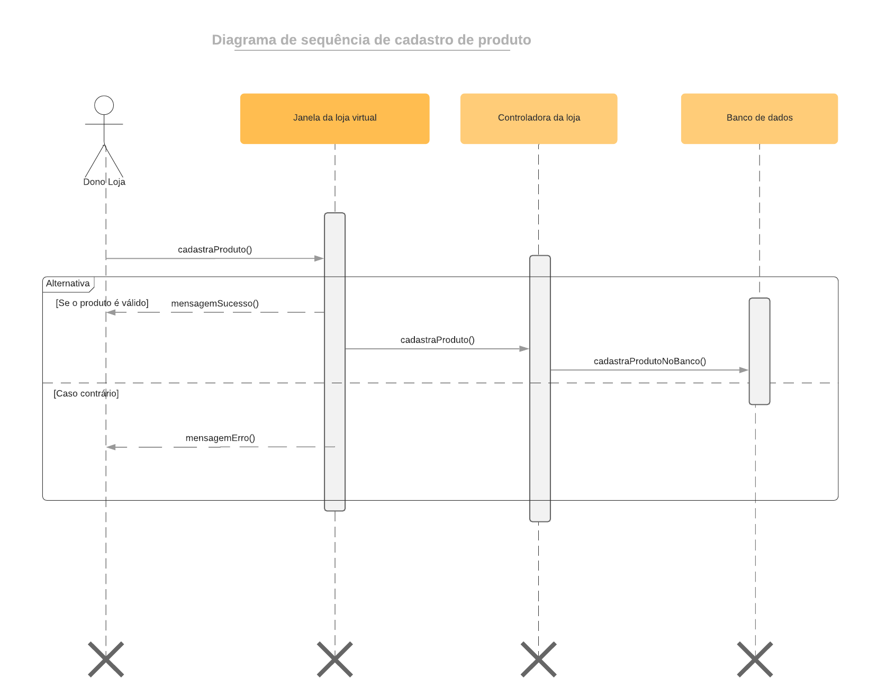
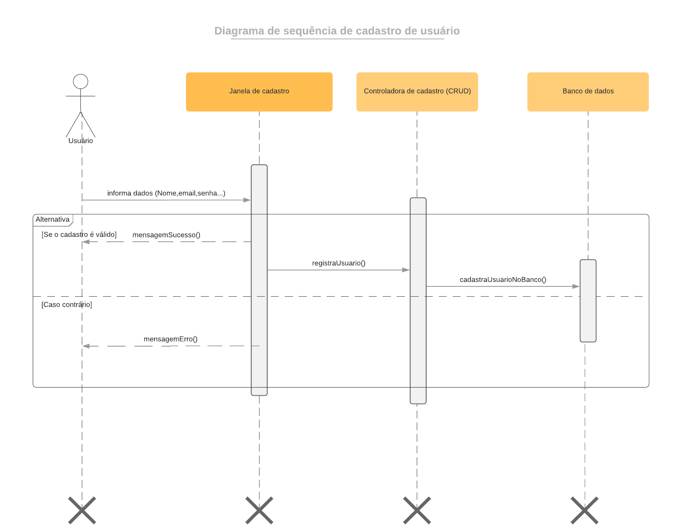

# Diagramas de Sequência

O Diagrama de sequência é um diagrama que mostra a relação temporal entre os componentes do sistema.

Foi utilizado a ferramenta [LucidHart](www.lucidchart.com) para elaboração desse diagrama.

## V0.1

Feito por: [Gustavo Afonso](https://github.com/GustavoAPS)

Feito por: [Gustavo Afonso](https://github.com/GustavoAPS)

## Referência Bibliográficas
Sequence Diagrams Reference. Disponível em: https://www.uml-diagrams.org/sequence-diagrams-reference.html. Acesso em: 26 de fev. 2021.

## Versionamento

| Data | Versão | Descrição | Autor(es) |
|------|------|------|------|
|26/02/2021|0.1|Criando e adicionando a V0.0 do diagrama de sequência de registro de produto|[Gustavo Afonso](https://github.com/GustavoAPS)|
|01/03/2021|0.2|Adicionando diagrama de sequência de cadastro de usuário|[Gustavo Afonso](https://github.com/GustavoAPS)|