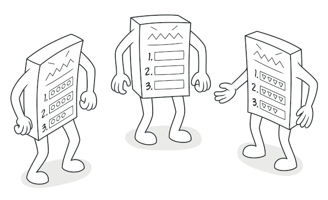
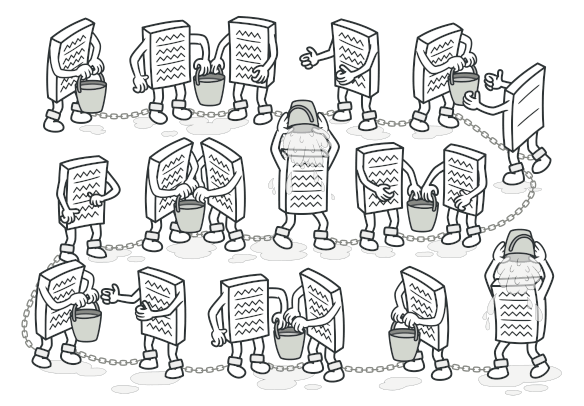
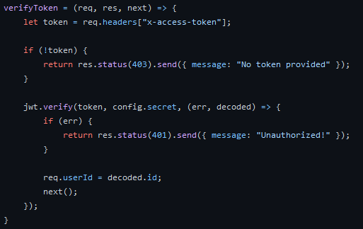
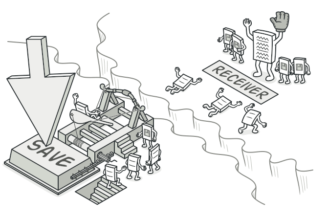
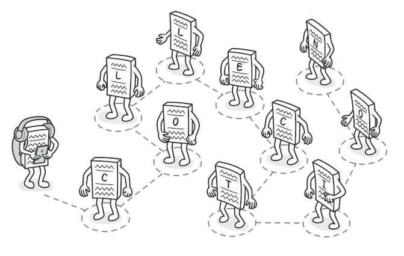
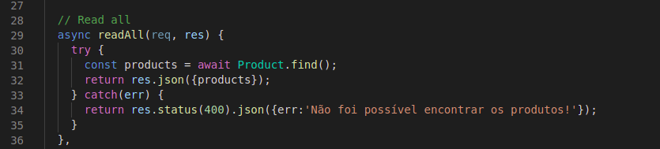
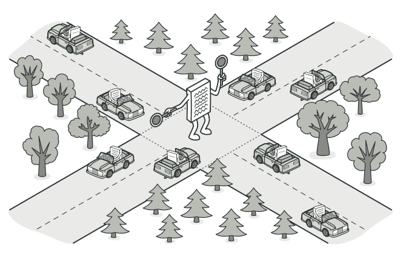
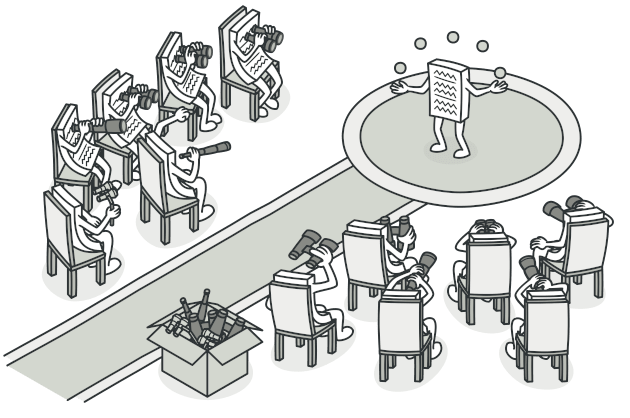
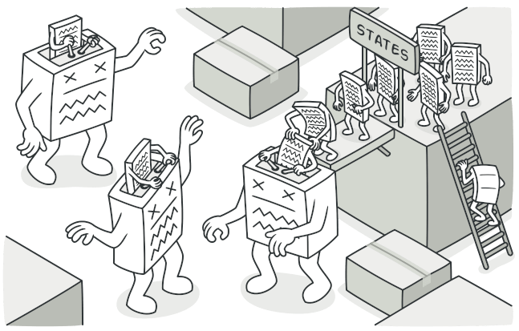
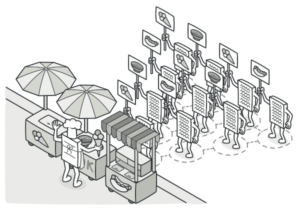

# GoFs Comportamentais

## Interpreter

É um padrão que fornece uma linguagem de script que permite que usuários finais personalizem sua solução. É utilizado em aplicações complexas, que exigem configurações avançadas. Desse modo, esse padrão fornece a possibilidade de manipulação da aplicação, pelo usuário final, com uma linguagem de script básica. 

### Uso no projeto e justificativa

Não foi encontrado nenhum elemento no projeto em que o padrão interpreter fosse aplicável. Mas é interessante ressaltar que caso seja necessário utilizar esse padrão em algum projeto que utilize JavaScript, o ideal seria utilizar um gerador de código como o [ANTLR](https://www.antlr.org/tools.html), que permite a construção de seu próprio interpretador de comandos, baseado na gramática informada.

## Template Method

É um padrão que traz a definição do esqueleto de um algoritmo para alguma operação, adiando a definição de alguns sub passos para  a subclasse.

  
*Imagem sobre template method.* Disponível em: https://refactoring.guru/design-patterns/template-method

### Uso no projeto e justificativa

## Chain of Responsibility

É um padrão que dá a oportunidade a mais de um objeto de lidar com uma solicitação. Isso significa que uma mesma solicitação passa por uma série de objetos em cadeia (objetos receptores e objetos de solicitação), até que algum seja capaz de tratar a solicitação. Uma vantagem no uso desse padrão é evitar a dependência entre um objeto receptor e um objeto solicitante. 

  
*Imagem sobre chain of responbibility.* Disponível em: https://refactoring.guru/design-patterns/chain-of-responsibility

### Uso no projeto e justificativa

O NodeJS em conjunto com a API Express faz uso de funções chamadas Middleware. Essas funções têm acesso ao objeto de requisição (req), o objeto de resposta (res), e a próxima função de middleware (next) dentro do ciclo de solicitação-resposta da aplicação. 

As funções middleware podem executar qualquer código, fazer mudanças nos objetos de solicitação e resposta, encerrar o ciclo de solicitação-resposta e chamar o próximo middleware na fila. 

    

No nosso projeto, foi feito o uso de middleware na autenticação do usuário, para assegurar que só terá acesso a determinadas funcionalidades do site o usuário que possuir conta em nosso sistema e estiver devidamente logado. 

## Command

Esse padrão de projeto encapsula as ações dos objetos. É um objeto utilizado para realizar a chamada de determinado componente, bem como controlar as suas requisições. Ou seja, há uma separação entre um objeto que controla as requisições, com o objeto que lida com essas requisições.

  
*Imagem sobre command.* Disponível em: https://refactoring.guru/design-patterns/command

### Uso no projeto e justificativa

Não encontramos um aspecto do projeto que contemple esse padrão de projeto.

## Iterator 

É um padrão que possibilita percorrer uma coleção de objetos, sem que o encapsulamento dos mesmos seja violado.

  

O padrão iterator foi utilizado no código abaixo por exemplo, onde é requisitado uma lista de objetos do banco de dados e eles são iterados ao serem enviados para o backend.

  
*Trecho de código mostrando uma iteração.* 

Disponível em: https://refactoring.guru/design-patterns/iterator

[Link para o código](https://github.com/UnBArqDsw2020-2/2020.2_G5_EasyCoffee_Backend/blob/dev/src/controllers/productController.js)

### Uso no projeto e justificativa

Como já citado acima foi utilizado um iterator no código onde é requisitada uma lista de objetos do banco de dados e eles são iterados ao serem enviados para o backend.

## Mediator

É um padrão que fornece uma autoridade central sobre um grupo de objetos, encapsulando como esses objetos interagem entre si. Isso traz um desacoplamento da gestão de interações entre um grupo de objetos, fazendo com que ocorra a diminuição da ligação entre objetos do projeto.

  
*Imagem sobre mediator.* Disponível em: https://refactoring.guru/design-patterns/mediator

### Uso no projeto e justificativa

Não encontramos um aspecto do projeto que contemple esse padrão de projeto, mas ao longo do desenvolvimento quando surgirem dependencias ele vai ser bastante utilizado.

## Memento

É um padrão que armazena o estado de um objeto em um dado momento, permitindo a volta para esse estado caso alguma alteração seja feita.

  
*Imagem sobre memento.* Disponível em: https://refactoring.guru/design-patterns/memento

### Uso no projeto e justificativa

Não encontramos um aspecto do projeto que contemple esse padrão de projeto, mas caso futuramente seja útil salvar o estado de objetos esse padrão será usado.

## Observer

É um padrão que cria uma relação de dependência entre objetos (1:N) que funciona da seguinte maneira: quando um certo objeto, chamado subject, tem seu estado modificado, outros objetos, chamados observers, são notificados. 

  
*Imagem sobre observer.* Disponível em: https://refactoring.guru/design-patterns/observer

### Uso no projeto e justificativa

Não encontramos um aspecto do projeto que contemple esse padrão.

## State

É um padrão que faz com que um objeto altere o seu comportamento quando o seu estado interno mudar. O objeto irá aparentar mudar de classe.

  
*Imagem sobre state.* Disponível em: https://refactoring.guru/design-patterns/state

### Uso no projeto e justificativa
Não usamos no projeto para essa entrega. Mas nas próximas sprints, será estudada a possibilidade do seu uso no Frontend do projeto, através do uso do useState do React, em especial na parte de login. Pois quando o usuário loga, novas funcionalidades se tornam disponíveis.

## Strategy

É um padrão que traz a possibilidade de uma família de algoritmos ser utilizada de forma seletiva e independente. Esse padrão encapsula determinados algoritmos alternativos para uma determinada tarefa. 

  
*Imagem sobre strategy.* Disponível em: https://refactoring.guru/design-patterns/strategy

### Uso no projeto e justificativa

Nesse primeiro momento, não foi utilizado no projeto, pois não foi implementado algo que se aplicasse. Entretanto, será estudado a possibilidade do uso desse padrão para implementar o frete. Que pode ser calculado de formas diferentes, a depender do tipo de entrega escolhida.

## Visitor

O padrão visitor define novas operações a serem realizadas em uma coleção de objetos sem alterar os objetos em si.

  
*Imagem sobre visitor.* Disponível em: https://refactoring.guru/design-patterns/visitor

### Uso no projeto e justificativa

Não foi implementado no projeto, pois não foi encontrado algum aspecto do projeto que se aplique. Além disso, a própria linguagem de programação JavaScript tem grande flexibilidade fornecendo a possibilidade de adicionar e remover métodos em tempo de execução, desse modo esse não é um padrão muito utilizado quando se usa essa linguagem no desenvolvimento de um projeto.

## Versionamento

| Data | Versão | Descrição | Autor(es) |
|------|------|------|------|
|07/04/2021|1.0|Adiciona estrutura inicial de gofs comportamentais e chain of responsibility|[Gabrielle Ribeiro](https://github.com/Gabrielle-Ribeiro)|
|07/04/2021|1.1|Adiciona Resumo sobre iteretor e memento|[Gustavo Afonso](https://github.com/GustavoAPS)|
|07/04/2021|1.2|Adiciona Resumo sobre State|[Iago Theóphilo](https://github.com/iagotheophilo)|
|08/04/2021|1.3|Adiciona Resumo sobre Strategy|[Itallo Gravina](https://github.com/itallogravina)|
|08/04/2021|1.4|Adiciona Resumo sobre Interpreter|[Danilo Domingo](https://github.com/danilow200)|
|08/04/2021|1.5|Adiciona Resumo sobre Visitor|[Gustavo Afonso](https://github.com/GustavoAPS)|
|08/04/2021|1.6|Adiciona Uso no Projeto e Justificativa State|[Maicon Mares](https://github.com/MaiconMares)|
|08/04/2021|1.7|Adiciona resumo sobre Template Method, Command e Mediator|[Rafael Ribeiro](https://github.com/rafaelflarrn)|
|08/04/2021|1.8|Adiciona resumo sobre observer|[Gabrielle Ribeiro](https://github.com/Gabrielle-Ribeiro)|
|08/04/2021|1.9|Adiciona código exemplo do Chain of Responsibility|[Danilo Domingo](https://github.com/danilow200)|
|09/04/2021|1.10|Adiciona imagens explicativas sobre os gofs comportamentais|[Gabrielle Ribeiro](https://github.com/Gabrielle-Ribeiro)|
|08/04/2021|1.11|Adiciona justificativas de uso no projeto|[Gustavo Afonso](https://github.com/GustavoAPS)|