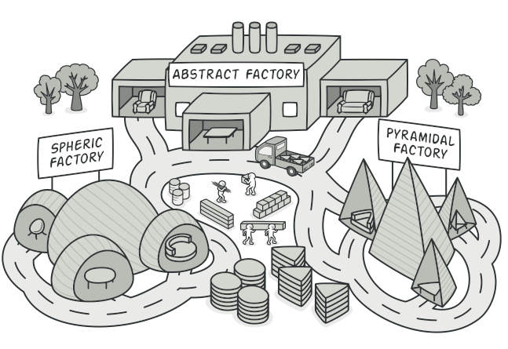
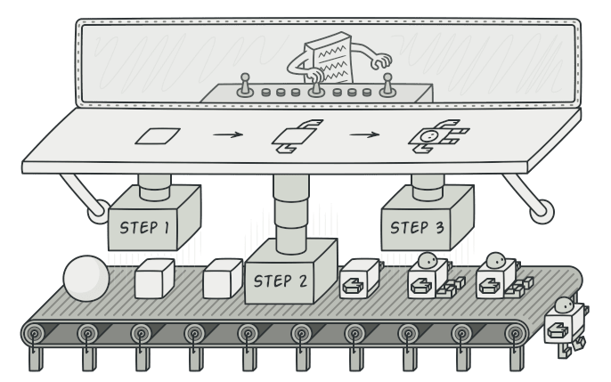
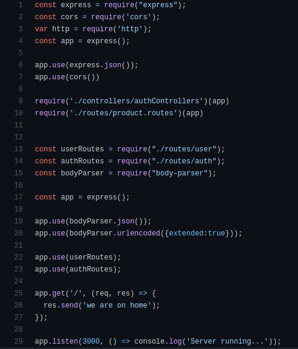
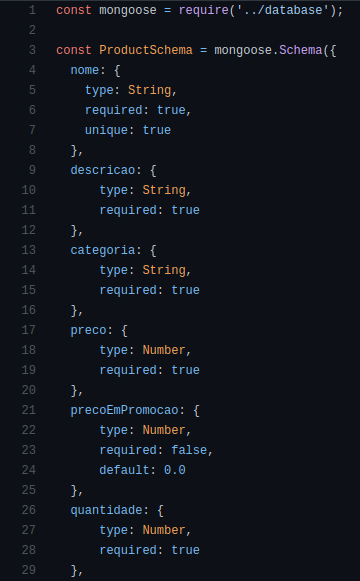
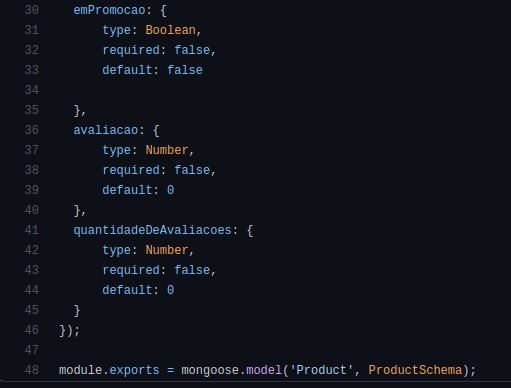

# GoFs Criacionais

Os GoFs Criacionais estão relacionados à criação de classes e objetos, bem como ao processo de instanciação.

## Factory Method

O padrão Factory Method foca na criação de objetos dentro de uma aplicação. Ele usa classes para atuar como fábricas de criar objetos. Esse padrão favorece o método de invocação em vez de fazer chamadas diretas ao construtor para criar objetos, podendo criar objetos sem especificar a classe exata a ser criada.

#### Uso no projeto e justificativa

Não foi encontrado em nosso projeto algum aspecto que contemplasse esse padrão de projeto. O objetivo central do Factory Method é extensibilidade. Caso o nosso projeto utilizasse arquivos com diferentes extensões, como por exemplo XML, PDF, RTF, etc, esse padrão seria uma boa escolha.

## Abstract Factory

Define uma interface para criar todos os produtos distintos, mas deixa a criação real do produto para classes fábrica concretas. Cada tipo de fábrica corresponde a uma determinada variedade de produtos. É um padrão de projeto criacional, que resolve o problema de criar famílias inteiras de produtos sem especificar suas classes concretas.

  
*Imagem sobre abstract factory.* Disponível em: https://refactoring.guru/design-patterns/abstract-factory

#### Uso no projeto e justificativa

Não foi encontrado em nosso projeto algum aspecto que contemplasse esse padrão de projeto. Caso nosso projeto envolvesse compartilhamento e reuso de objetos, lógicas completas, etc., o que necessitaria maior controle sob esses objetos, esse padrão poderia ser utilizado. 

## Builder 

O Builder é um padrão de projeto clássico dos GoFs criacionais. Ele é similar aos outros padrões criacionais, como o factory method e abstract factory, que se concentram com a criação de objetos. Ele consiste em separar a construção de um objeto complexo de sua implementação, então o mesmo processo de construção pode criar diferentes implementações.

  
*Imagem sobre abstract factory.* Disponível em: https://refactoring.guru/design-patterns/builder

#### Uso no projeto e justificativa

Não foi encontrado em nosso projeto algum aspecto que contemplasse esse padrão de projeto.

## Singleton

O padrão Singleton faz a garantia de que apenas um objeto de uma determinada classe será criado no projeto, ou seja, existirá somente uma instância dessa classe. A aplicação deverá prover um ponto de acesso global a esse objeto e garantir que independente do número de requisições para criação do objeto, apenas um único existirá.

  
*Imagem sobre abstract factory.* Disponível em: https://refactoring.guru/design-patterns/singleton

#### Uso no projeto e justificativa

No nosso projeto utilizamos esse padrão no código index.js que é responsável por subir o servidor do nosso projeto. Ele é o único componente desse tipo que pode existir no projeto. 

  
[Link para o código](https://github.com/UnBArqDsw2020-2/2020.2_G5_EasyCoffee_Backend/blob/dev/src/index.js)

## Prototype

O padrão Prototype faz a criação de novos objetos, mas ao invés de criar objetos com valores não inicializados, ele cria objetos através da cópia dos valores de um protótipo.

  
*Imagem sobre abstract factory.* Disponível em: https://refactoring.guru/design-patterns/prototype

#### Uso no projeto e justificativa

No nosso projeto, esse padrão pode ser observado no produto, que quando é criado, ele já possui uma estrutura com valores pré-definidos, que não sao necessários serem especificados no momento de criação.

    
  

[Link para o código](https://github.com/UnBArqDsw2020-2/2020.2_G5_EasyCoffee_Backend/blob/dev/src/models/Product.js)

Esse padrão foi utilizado por conta dos benefícios oferecidos nativamente pelo JavaScript, além de ser um padrão fácil de ser aplicado, isso pode melhorar a performace.

## Referências Bibliográficas

**Builder Pattern.** Disponível em: https://springframework.guru/gang-of-four-design-patterns/builder-pattern/. Acesso em: 08 de abril de 2021.

**Factory Method Design Pattern** Disponível em: https://springframework.guru/gang-of-four-design-patterns/factory-method-design-pattern/. Acesso em: 08 de abril de 2021.

## Versionamento

| Data | Versão | Descrição | Autor(es) |
|------|------|------|------|
|07/04/2021|1.0|Adiciona resumo sobre GoFs Criacionais|[Danilo Domingo](https://github.com/danilow200), [Gabrielle Ribeiro](https://github.com/Gabrielle-Ribeiro), [Gustavo Afonso](https://github.com/GustavoAPS), [Iago Theóphilo](https://github.com/IagoTheophilo), [Itallo Gravina](https://github.com/itallogravina), [Maicon Mares](https://github.com/MaiconMares), [Rafael Ribeiro](https://github.com/rafaelflarrn)|
|07/04/2021|1.1|Adiciona resumo sobre singleton|[Gabrielle Ribeiro](https://github.com/Gabrielle-Ribeiro)|
|07/04/2021|1.1|Adiciona resumo sobre Prototype|[Iago Theóphilo](https://github.com/iagotheophilo)|
|08/04/2021|1.2|Adiciona resumo sobre Builder|[Rafael Ribeiro](https://github.com/rafaelflarrn)| 
|08/04/2021|1.3|Adiciona resumo sobre Factory Method|[Rafael Ribeiro](https://github.com/rafaelflarrn)| 
|09/04/2021|1.4|Adiciona como foi aplicado o padrão Prototype|[Rafael Ribeiro](https://github.com/rafaelflarrn), [Iago Theóphilo](https://github.com/iagotheophilo), [Itallo Gravina](https://github.com/itallogravina)|
|09/04/2021|1.5|Adiciona justificativa do padrão prototype|[Gabrielle Ribeiro](https://github.com/Gabrielle-Ribeiro)|
|09/04/2021|1.5|Adiciona justificativa dos padrões de projeto Factory Method, Abstract Factory, |[Gabrielle Ribeiro](https://github.com/Gabrielle-Ribeiro)|

