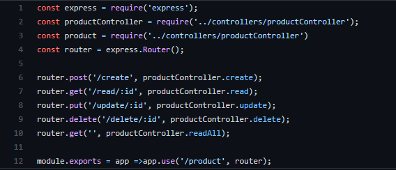

# GoFs Estruturais

## Adapter

O Adapter é um padrão de projeto clássico dos GoFs estruturais. Compõem padrões nos quais o objetivo é identificar como entender relacionamentos entre classes e objetos de uma forma simples. Esse padrão é tipicamente usado quando um módulo incompatível necessita ser integrado com um módulo já existente sem que haja nenhuma modificação no código fonte. 
Há duas variantes do Adapter: Object Adapter que depende da composição e a Class Adapter que depende da herança.

### Uso no projeto e justificativa

## Bridge

Bridge é um padrão de design estrutural que permite dividir uma grande classe ou um conjunto de classes intimamente relacionadas em duas hierarquias separadas em abstração e implementação, que podem ser desenvolvidas independentemente uma da outra.

### Uso no projeto e justificativa

Um exemplo do padrão Bridge é um aplicativo (o cliente) e um driver de banco de dados (o serviço). O aplicativo grava em uma API de banco de dados bem definida, por exemplo MongoDB, mas por trás dessa API você descobrirá que a implementação de cada driver é totalmente diferente para cada fornecedor de banco de dados (SQL Server, MySQL, Oracle, etc.).

 

## Composite

Usando o padrão Composite é possível criar árvores hierárquicas de objetos de uma maneira uniforme sem grande complexidade. Compondo objetos em estruturas de árvores para representar relações hierárquicas parte-todo. O padrão Composite permite aos clientes tratar objetos de forma individual e composições de objetos uniformemente, ou seja, o cliente pode ser capaz de aplicar as mesmas operações sobre ambas agregações de objetos(todo) e objetos individuais(parte).

### Uso no projeto e justificativa

## Decorator

### Uso no projeto e justificativa

## Facade

É um padrão que oculta a complexidade de uma ou mais classes por meio de uma facade (fachada), com o objetivo de simplificar uma interface e o acesso a mesma. Uma definição mais oficial do padrão facade é “O Padrão Facade fornece uma interface unificada para um conjunto de interfaces em um subsistema. O Facade define uma interface de nível mais alto que facilita a utilização do subsistema”.

### Uso no projeto e justificativa

No nosso projeto, a lógica de funcionamento de cada classe se encontra dentro das controllers correspondentes a cada model. Entretanto, foi feita uma separação das controllers e suas rotas, visando uma maior facilidade, já que a parte responsável pelas rotas possui uma grande simplicidade e delega o trabalho mais robusto às funções que estão nas controllers.

*Rotas de produto*

[Link para o código](https://github.com/UnBArqDsw2020-2/2020.2_G5_EasyCoffee_Backend/blob/dev/src/routes/product.routes.js)

    
## Flyweight

### Uso no projeto e justificativa

## Proxy

É um padrão de projeto que fornece um objeto representando visando controlar o acesso a outro objeto. Normalmente, o objeto Proxy tem a mesma interface do objeto original, e o cliente talvez nem se dê conta que está lidando com um proxy ao invés de um objeto real.

### Uso no projeto e justificativa

## Referências Bibliográficas

**Adapter Pattern.** Disponível em: https://springframework.guru/gang-of-four-design-patterns/adapter-pattern/. Acesso em: 08 de abril de 2021.

**Composite Pattern.** Disponível em: https://springframework.guru/gang-of-four-design-patterns/composite-pattern/. Acesso em: 08 de abril de 2021.

## Versionamento

| Data | Versão | Descrição | Autor(es) |
|------|------|------|------|
|07/04/2021|1.0|Adiciona estrutura inicial de gofs estruturais e resumo sobre facade|[Gabrielle Ribeiro](https://github.com/Gabrielle-Ribeiro)|
|08/04/2021|1.1|Adiciona resumo sobre Builder|[Rafael Ribeiro](https://github.com/rafaelflarrn)| 
|08/04/2021|1.2|Adiciona resumo sobre Composite|[Rafael Ribeiro](https://github.com/rafaelflarrn)|
|08/04/2021|1.3|Adiciona resumo sobre Proxy|[itallo Gravina](https://github.com/itallogravina)|
|09/04/2021|1.4|Adiciona código de rotas de produto|[Gabrielle Ribeiro](https://github.com/Gabrielle-Ribeiro), [Gustavo Afonso](https://github.com/GustavoAPS) e [itallo Gravina](https://github.com/itallogravina)|
|09/04/2021|1.5|Adiciona resumo e justificativa do Bridge|[Danilo Domingo](https://github.com/danilow200)|

