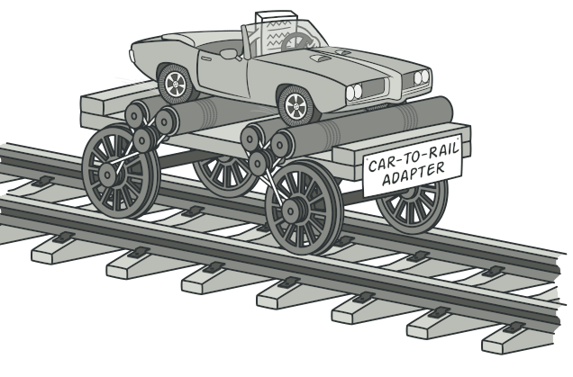
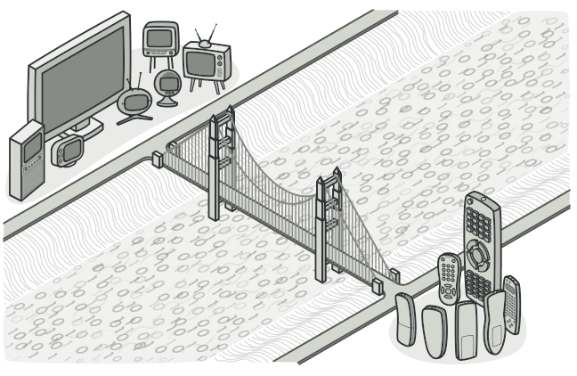
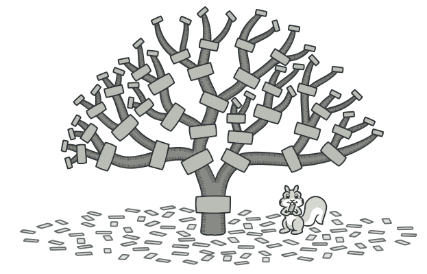
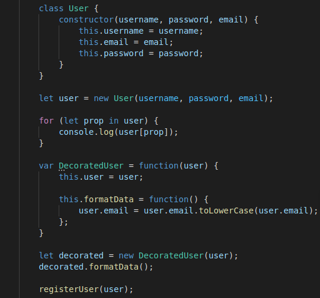
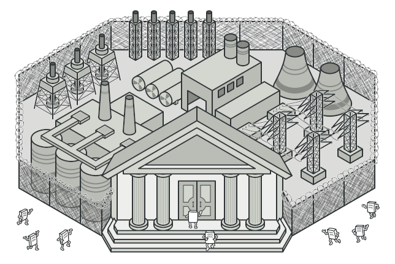
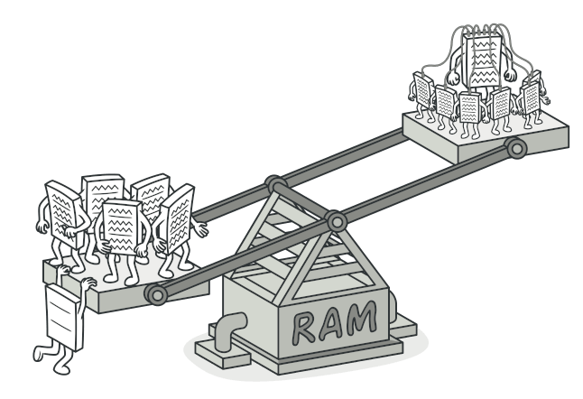
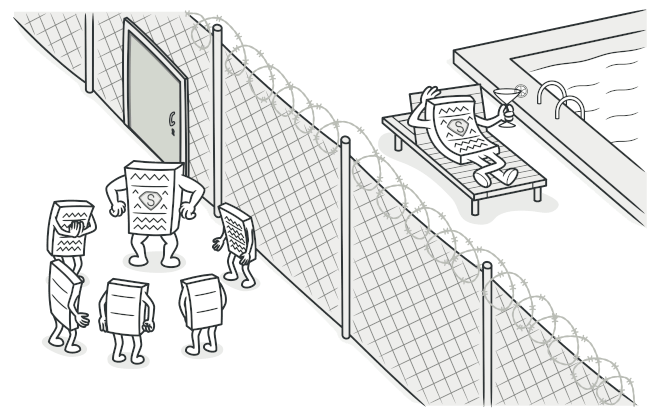

# GoFs Estruturais

## Adapter

O Adapter é um padrão de projeto clássico dos GoFs estruturais. Compõem padrões nos quais o objetivo é identificar como entender relacionamentos entre classes e objetos de uma forma simples. Esse padrão é tipicamente usado quando um módulo incompatível necessita ser integrado com um módulo já existente sem que haja nenhuma modificação no código fonte. 
Há duas variantes do Adapter: Object Adapter que depende da composição e a Class Adapter que depende da herança.

  
*Imagem sobre adapter.* Disponível em: https://refactoring.guru/design-patterns/adapter

### Uso no projeto e justificativa

Não se aplica ao nosso projeto. Mas, um cenário em que os adaptadores são comumente usados é quando novos componentes precisam ser integrados e trabalhar em conjunto com os componentes existentes no aplicativo, assim sendo naturalmente utilizado no projeto para fazer a comunicação entre os componentes. 

## Bridge

Bridge é um padrão de design estrutural que permite dividir uma grande classe ou um conjunto de classes intimamente relacionadas em duas hierarquias separadas em abstração e implementação, que podem ser desenvolvidas independentemente uma da outra.

  
*Imagem sobre bridge.* Disponível em: https://refactoring.guru/design-patterns/bridge

### Uso no projeto e justificativa

Não se aplica ao nosso projeto. Porém, um exemplo do padrão Bridge é um aplicativo (o cliente) e um driver de banco de dados (o serviço). O aplicativo grava em uma API de banco de dados bem definida, por exemplo MongoDB, mas por trás dessa API você descobrirá que a implementação de cada driver é totalmente diferente para cada fornecedor de banco de dados (SQL Server, MySQL, Oracle, etc.).

 

## Composite

Usando o padrão Composite é possível criar árvores hierárquicas de objetos de uma maneira uniforme sem grande complexidade. Compondo objetos em estruturas de árvores para representar relações hierárquicas parte-todo. O padrão Composite permite aos clientes tratar objetos de forma individual e composições de objetos uniformemente, ou seja, o cliente pode ser capaz de aplicar as mesmas operações sobre ambas agregações de objetos(todo) e objetos individuais(parte).

  
*Imagem sobre composite.* Disponível em: https://refactoring.guru/design-patterns/composite

### Uso no projeto e justificativa

Utilizado em uma estrutura de árvore é criada a partir de objetos Node, com ele podendo conter vários métodos, assim entrando naturalmente no projeto ao criar um objeto novo com mais de um método.

## Decorator

O padrão Decorator permite estender um objeto dinamicamente em tempo de execução sem alterar a sua interface. A habilidade de adicionar um novo comportamento ao objeto é possível através de um objeto decorador que 'embrulha' a si mesmo em torno do objeto original. Dessa maneira, é possível adicionar novas funcionalidades ao objeto sem alterar a estrutura de sua classe, por exemplo.

### Uso no projeto e justificativa

Nesse projeto, é necessária a criação de conta de usuário para acessar determinadas áreas do site. Entretanto, os dados devem ser formatados antes de enviar para o backend processar. A classe de usuário tem o propósito de apenas agrupar os dados e permitir a sua criação não sendo sensato delegar a esta a funcionaliadade de formatação dos dados antes de seu envio ao backend. Logo, criou-se um decorador que adiciona, ao objeto gerado pela classe, a funcionalidade de formatação.

## Facade

É um padrão que oculta a complexidade de uma ou mais classes por meio de uma facade (fachada), com o objetivo de simplificar uma interface e o acesso a mesma. Uma definição mais oficial do padrão facade é “O Padrão Facade fornece uma interface unificada para um conjunto de interfaces em um subsistema. O Facade define uma interface de nível mais alto que facilita a utilização do subsistema”.

  
*Imagem sobre facade.* Disponível em: https://refactoring.guru/design-patterns/facade

### Uso no projeto e justificativa

No nosso projeto, a lógica de funcionamento de cada classe se encontra dentro das controllers correspondentes a cada model. Entretanto, foi feita uma separação das controllers e suas rotas, visando uma maior facilidade, já que a parte responsável pelas rotas possui uma grande simplicidade e delega o trabalho mais robusto às funções que estão nas controllers.

*Rotas de produto*

[Link para o código](https://github.com/UnBArqDsw2020-2/2020.2_G5_EasyCoffee_Backend/blob/dev/src/routes/product.routes.js)

    
## Flyweight

Flyweight é um padrão de design estrutural que permite ajustar mais objetos na quantidade disponível de RAM, compartilhando partes comuns de estado entre vários objetos, em vez de manter todos os dados em cada objeto. 

  
*Imagem sobre flyweight.* Disponível em: https://refactoring.guru/design-patterns/flyweight

### Uso no projeto e justificativa

O Flyweight está dentro do próprio mecanismo JavaScript, que mantém uma lista de strings imutáveis que são compartilhadas no aplicativo.

## Proxy

É um padrão de projeto que fornece um objeto representando visando controlar o acesso a outro objeto. Normalmente, o objeto Proxy tem a mesma interface do objeto original, e o cliente talvez nem se dê conta que está lidando com um proxy ao invés de um objeto real.

  
*Imagem sobre proxy.* Disponível em: https://refactoring.guru/design-patterns/proxy

### Uso no projeto e justificativa

O proxy não se encaixa no escopo do projeto.

## Referências Bibliográficas

**Adapter Pattern.** Disponível em: https://springframework.guru/gang-of-four-design-patterns/adapter-pattern/. Acesso em: 08 de abril de 2021.

**Composite Pattern.** Disponível em: https://springframework.guru/gang-of-four-design-patterns/composite-pattern/. Acesso em: 08 de abril de 2021.

## Versionamento

| Data | Versão | Descrição | Autor(es) |
|------|------|------|------|
|07/04/2021|1.0|Adiciona estrutura inicial de gofs estruturais e resumo sobre facade|[Gabrielle Ribeiro](https://github.com/Gabrielle-Ribeiro)|
|08/04/2021|1.1|Adiciona resumo sobre Builder|[Rafael Ribeiro](https://github.com/rafaelflarrn)| 
|08/04/2021|1.2|Adiciona resumo sobre Composite|[Rafael Ribeiro](https://github.com/rafaelflarrn)|
|08/04/2021|1.3|Adiciona resumo sobre Proxy|[itallo Gravina](https://github.com/itallogravina)|
|09/04/2021|1.4|Adiciona código de rotas de produto|[Gabrielle Ribeiro](https://github.com/Gabrielle-Ribeiro), [Gustavo Afonso](https://github.com/GustavoAPS) e [itallo Gravina](https://github.com/itallogravina)|
|09/04/2021|1.5|Adiciona resumo e justificativa do Bridge|[Danilo Domingo](https://github.com/danilow200)|
|09/04/2021|1.6|Adiciona resumo e justificativa do Decorator|[Danilo Domingo](https://github.com/danilow200)|
|09/04/2021|1.7|Adiciona resumo e justificativa do Flyweight|[Danilo Domingo](https://github.com/danilow200)|
|09/04/2021|1.8|Adiciona restante das propostas e justificativas|[Danilo Domingo](https://github.com/danilow200)|
|09/04/2021|1.9|Adiciona imagens e revisa documento.|[Gabrielle Ribeiro](https://github.com/Gabrielle-Ribeiro)|
