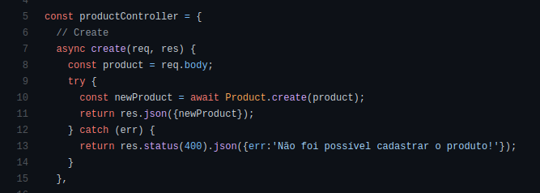
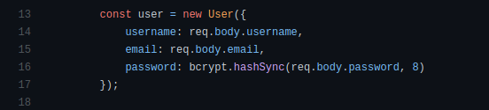
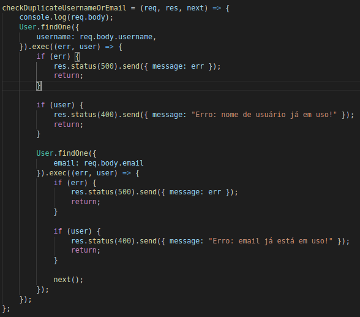
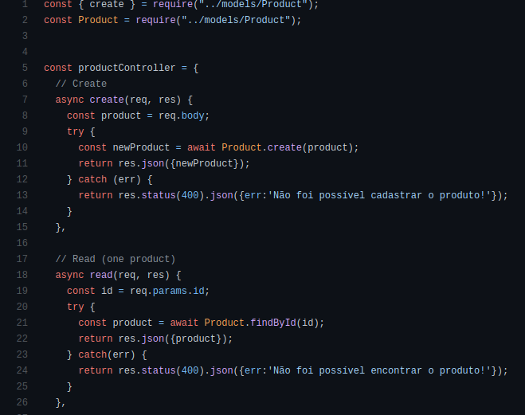
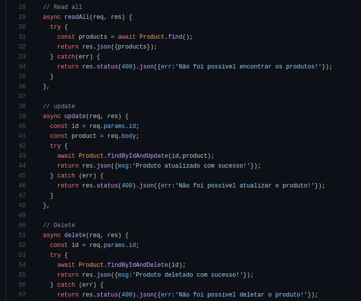
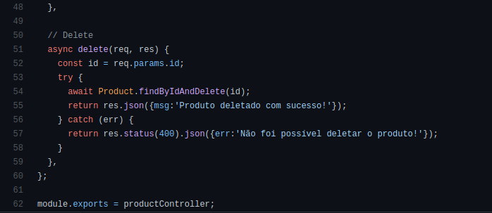

# GRASPs

Quando um software é desenvolvido, é de suma importância a utilização de padrões de projetos. Esses padrões definem os princípios e soluções que serão utilizados na criação desse software. 
Os padrões GRASPS - General Responsibility Assignment Software Patterns são um tipo de padrão de projeto que traz alguns princípios para a criação de softwares de qualidade com o uso da programação orientada a objetos, tendo como base conceitos de atribuição de responsabilidades as classes e objetos do programa.
De forma geral, isso significa que esse padrão de projeto está preocupado em compreender e responder a seguinte questão: “Quem faz o que?”.

Dentro do GRASP são definidos 9 padrões, sendo eles:

### Criador

O GRASP Criador ou Creator se preocupa em determinar qual classe deve ser a responsável pela criação de instâncias de certos objetos.

Na maioria das vezes a melhor classe para criar uma certa instância é ela própria. Mas nem sempre isso é verdade.

Existem certas situações, onde a responsabilidade da criação de instâncias da classe A é da classe B. Se existe uma relação de composição, onde A só existe caso B exista, então B será responsável  por criar A. Para saber se as instâncias de uma classe A serão criadas por uma classe B, é importante observar os seguintes pontos e caso algum seja verdadeiro, então B cria A:

 - B “contém” A ou é uma composição de A.
 - B registra A.
 - B usa A de maneira muito próxima.
 - B tem dados iniciais de A, os quais serão passados para A quando este for criado. B é um “especialista” em relação à criação de A.

#### Uso no projeto e justificativa

No nosso projeto, o produto é responsável pela sua própria criação.

  

[Link para o código](https://github.com/UnBArqDsw2020-2/2020.2_G5_EasyCoffee_Backend/blob/dev/src/controllers/productController.js)

O user também é responsável pela sua criação.

  

[Link para o código](https://github.com/UnBArqDsw2020-2/2020.2_G5_EasyCoffee_Backend/blob/dev/src/controllers/auth.controller.js)

### Especialista

O GRASP especialista é um padrão que se preocupa em atribuir responsabilidades a entidade especialista em determinado aspecto, de modo que cada tarefa seja feita por uma entidade que seja mais especialista naquele aspecto.

#### Uso no projeto e justificativa

Em nosso projeto isso pode ser observado no trecho de código a seguir, que é responsável por checar se o usuário já existe no banco de dados.

  
[Link para o código](https://github.com/UnBArqDsw2020-2/2020.2_G5_EasyCoffee_Backend/blob/dev/src/middlewares/verifySignUp.js)

Na criação de novos usuários (signup) é necessário que sejam feitas validações em relação ao formato dos dados tanto quanto verificações de atributos que devem ser únicos para cada usuário. A primeira tarefa é desempenhada bem pelas models, entretanto a segunda necessita de ajuda de um serviço adicional. Uma middleware foi criada apenas com o propósito de realizar as verificações, rejeitar ou permitir a criação e no caso de rejeição retornar o erro.

### Alta Coesão

O GRASP Alta Coesão determina que as classes devem focar apenas nas suas responsabilidades e fazerem isso da melhor maneira possível. Desse modo, as classes não devem fazer tarefas não relacionadas e a atribuição de  responsabilidades deve ser feita visando manter a coesão da classe alta. Isso reduz o acoplamento, além de manter os objetos do sistema mais focados, compreensíveis e gerenciáveis.

Um sistema com classes com baixa coesão enfrentará diversos problemas, como: a difícil compreensão, difícil reutilização, difícil manutenção, fragilidade e necessidade frequente de alterações.

Assim, para verificar se as classes possuem alta coesão, basta verificar se ela possui uma quantidade relativamente pequena de métodos, as funcionalidades desses métodos são altamente relacionadas e a classe não faz trabalho demais.

#### Uso no projeto e justificativa

No nosso projeto, tentamos manter a coesão mais alta possível, mantendo as tarefas sob a resposabilidade das classes referentes. 

### Baixo Acoplamento

O GRASP Baixo Acoplamento é um padrão que diz que não deve haver dependência entre objetos concretos das classes, para que as mudanças possam ser feitas sem que haja um grande impacto e seja possível a reutilização. Desse modo, as responsabilidades entre as classes devem ser atribuídas de modo que o acoplamento entre estas permaneça baixo. 

#### Uso no projeto e justificativa

No nosso projeto, tentamos manter o baixo acoplamento, especialmente durante a codificação, para que haja a menor dependência possível entre as classes.

### Controller

O GRASP Controller ou controlador é um padrão que se preocupa em atribuir a responsabilidade de lidar com os eventos do sistema à classe mais adequada, ou seja, o controller faz a ligação entre as ações que ocorrem na interface do usuário com a lógica de comportamento de seu sistema.

Desse modo, o controller faz com que a camada de interação com o usuário seja separada da camada responsável pela lógica do sistema. Assim, cada camada se torna mais independente e menos sensível a alterações feitas na outra camada. 

O controller, além de ser um padrão de projeto GRASP, também é um padrão utilizado amplamente no desenvolvimento de aplicações web atuais, que utilizam o padrão model-view-controller.

#### Uso no projeto e justificativa

Esse padrão, por ser algo já utilizado nos padrões de desenvolvimento web, foi aplicado em nosso projeto nas controllers de diversas models

*Controller de produto* 

   
   
  
[Link para o código](https://github.com/UnBArqDsw2020-2/2020.2_G5_EasyCoffee_Backend/blob/dev/src/controllers/productController.js)

[Controler de usuário](https://github.com/UnBArqDsw2020-2/2020.2_G5_EasyCoffee_Backend/blob/dev/src/controllers/auth.controller.js)

### Polimorfismo

O GRASP Polimorfismo é um padrão bastante conhecido, pois é bastante aplicado na Programação Orientada à Objetos. Esse padrão é utilizado quando duas ou mais classes possuem métodos com comportamento semelhante. Quando isso ocorre, é criado uma classe abstrata, onde a responsabilidade por aquelas ações se encontra nessa classe, e as demais classes derivam dessa abstração, podendo variar na implementação dos métodos conforme a necessidade.

#### Uso no projeto e justificativa

 Não se aplica no nosso projeto, especialmente porque JavaScrip não suporta classes abstratas.

### Invenção Pura (ou Fabricação Própria)

O GRASP de Invenção Pura traz uma classe que não está relacionada com nenhum conceito no domínio do problema.  É simplesmente uma classe prestadora de serviços. Isso auxilia o sistema a ter um baixo acoplamento e alta coesão. 

Um exemplo de invenção pura, está em um projeto onde várias classes precisam fazer a persistência dos dados de suas instâncias em um banco, e ao invés de atribuir essa responsabilidade a cada uma das classes, é criada uma outra classe que tenha a responsabilidade de salvar os dados das demais classes no banco de dados.

#### Uso no projeto e justificativa

 Não aplicamos no projeto.

### Indireção

O GRASP de Indireção faz a delegação de responsabilidades por meio de uma classe mediadora, evitando que ocorra o acoplamento direto entre duas classes. Desse modo, dois componentes não serão mais dependentes um do outro e sim da indireção, o que possibilita o reuso.

Um exemplo é a introdução do componente controlador para mediação entre dados (model) e sua representação (view) no padrão MVC

#### Uso no projeto e justificativa

 Não encontramos aplicação no projeto até o momento, mas talvez seja utilizado no futuro.

### Variações Protegidas

O GRASP Variações Protegidas é um padrão que protege o sistema com a variação de componentes, trazendo o encapsulamento dos comportamentos que são de fato importantes.

#### Uso no projeto e justificativa

 Não encontramos aplicação no projeto.

## Referências Bibliográficas

BOAS, Leandro Vilas. **Padrões GRASP - Padrões de Atribuir Responsabilidades.** Disponível em: https://medium.com/@leandrovboas/padr%C3%B5es-grasp-padr%C3%B5es-de-atribuir-responsabilidades-1ae4351eb204. Acesso em: 30 de março de 2021.

Universidade Federal de Uberlândia. **Padrões GRASP.** Disponível em: http://www.facom.ufu.br/~bacala/ESOF/05a-Padr%C3%B5es%20GRASP.pdf. Acesso em: 30 de março de 2021.

SERRANO, Milene. **Aula - GRASP - PARTE I.**

## Versionamento

| Data | Versão | Descrição | Autor(es) |
|------|------|------|------|
|07/04/2021|1.0|Adiciona resumo sobre GRASPs|[Danilo Domingo](https://github.com/danilow200), [Gabrielle Ribeiro](https://github.com/Gabrielle-Ribeiro), [Gustavo Afonso](https://github.com/GustavoAPS), [Iago Theóphilo](https://github.com/IagoTheophilo), [Itallo Gravina](https://github.com/itallogravina), [Maicon Mares](https://github.com/MaiconMares), [Rafael Ribeiro](https://github.com/rafaelflarrn)|
|07/04/2021|1.1|Adiciona resumo sobre Criador|[Gabrielle Ribeiro](https://github.com/Gabrielle-Ribeiro)|
|07/04/2021|1.2|Adiciona Resumo sobre especialista e alta coesão|[Gustavo Afonso](https://github.com/GustavoAPS)|
|07/04/2021|1.3|Adiciona Resumo sobre Baixo Acoplamento e Controller|[Iago Theóphilo](https://github.com/iagotheophilo)|
|07/04/2021|1.4|Adiciona resumo sobre Indireção|[Rafael Ribeiro](https://github.com/rafaelflarrn)| 
|08/04/2021|1.5|Adiciona resumo sobre Variações Protegidas|[Danilo Domingo](https://github.com/danilow200)
|08/04/2021|1.6|Adiciona resumo sobre Polimorfismo|[Maicon Mares](https://github.com/maiconmares)
|09/04/2021|1.7|Adiciona justificativas|[Gabrielle Ribeiro](https://github.com/Gabrielle-Ribeiro)|
