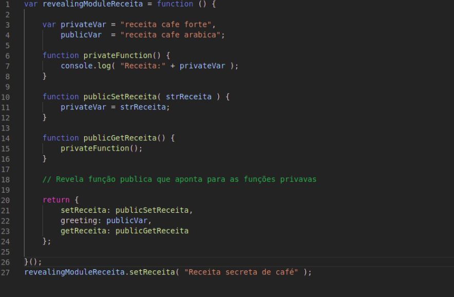
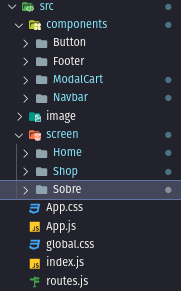

# Padrão Emergente

## Revealing Module

<p align="justify">Reavealing module pattern é um aperfeiçoamento do padrão de módulos usado no JavaScript, onde a intenção original é trabalhar com as visibilidades dos atributos e funções de forma a criar um bloco de código robusto e que apenas expõe variáveis e funções para o escopo em que são necessárias.</p>

<p align="justify">Já o padrão de revealing module, criado por Christian Heilmann, propõe que seja possível definir todas as funções e variáveis no escopo privado e retornar um objeto anônimo, com ponteiros para as funcionalidades privadas, para que essas sejam reveladas como públicas.</p>


### Uso no projeto e justificativa

<p align="justify">Para demonstrar o uso desse padrão de projeto, utilizamos um código toy dentro do contexto da nossa aplicação, futuramente o padrão vai ser aplicado na prática quando os códigos do projeto estiverem mais robustos.</p>

*Exemplo de Uso*



## Render Props
<p align="justify">É definido como uma simples técnica para compartilhar código entre dois componentes React utilizando uma prop, lê-se também propriedade, cujo valor/conteúdo é uma função.

Um componente com uma render prop pega uma função que retorna um elemento React e o chama ao invés de renderizar sua própria lógica. Basicamente, o render props é uma função que um componente recebe, contendo o que ele deve renderizar.

De modo geral, qualquer prop que tenha uma função e que vai ser utilizada para determinar o que um componente deve renderizar é considerada uma render prop.</p>


### Uso no projeto e justificativa
<p align="justify">Para demostrar o uso desse padrão de projeto, utilizamos a prop para passar parametros dentro de um contexto da nossa aplicação</p>

*Exemplo de Uso*
```javascript
export default function ModalCart({ isVisibleCart }) {
  return (
    <>
      {isVisibleCart &&
        <div className="container">
          <header>
            Seus prudutos
          </header>
          <main>
            <p>Produtos</p>
          </main>
          <footer>
            <h3>Total: R$99</h3>
            <Button name='COMPRAR' />
            <Button name='LIMPAR CARRINHO' />
          </footer>
        </div>
      }
    </>
  )
}
```

## Component Pattern 
<p align="justify">O padrão de componentes consiste basicamente em utilizar componentes, criando-os de forma suficientemente genérica para que possam ser reutilizados em boa parte do projeto.</p>

### Uso no projeto e justificativa

<p align="justify">Para demostrar o uso desse padrão de projeto, utilizamos a pasta components para armazenar o que sera reutilizado</p>




## Versionamento

| Data | Versão | Descrição | Autor(es) |
|------|------|------|------|
|09/04/2021|1.0|Adiciona estrutura inicial de padrões emergentes e resumo sobre revealing module|[Danilo Domingo](https://github.com/danilow200), [Gabrielle Ribeiro](https://github.com/Gabrielle-Ribeiro), [Gustavo Afonso](https://github.com/GustavoAPS), [Iago Theóphilo](https://github.com/IagoTheophilo), [Itallo Gravina](https://github.com/itallogravina), [Maicon Mares](https://github.com/MaiconMares), [Rafael Ribeiro](https://github.com/rafaelflarrn)|
|09/04/2021|1.1| Adicionando o padrão de proejto Render Props e o Uso no projeto e justificativa |[Iago Theóphilo](https://github.com/IagoTheophilo)|
|09/04/2021|1.1| Adicionando o padrão de proejto Component Pattern  e o Uso no projeto e justificativa |[Iago Theóphilo](https://github.com/IagoTheophilo)|

