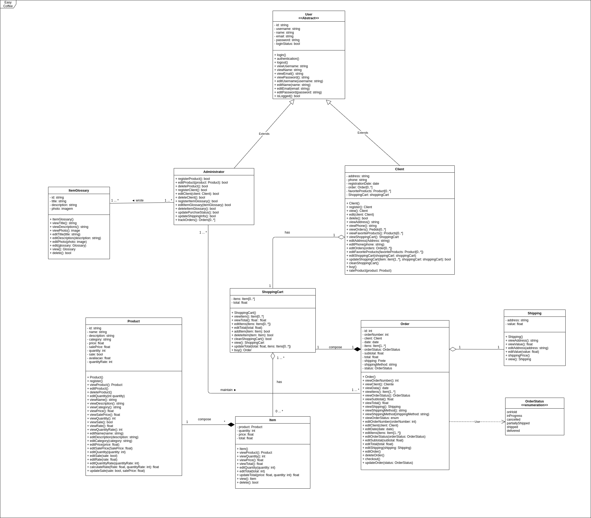

# Documento de Arquitetura de Software

## 1. Introdução

#### **1.1. Finalidade**
Este documento oferece uma visão geral arquitetural abrangente do sistema, usando diversas visões arquiteturais para representar diferentes aspectos do sistema. O objetivo deste documento é capturar e comunicar as decisões arquiteturais significativas que foram tomadas em relação ao sistema.

#### **1.2. Escopo**
Esse documento serve de guia para outros tópicos da construção arquitetural do software, abordando os principais pontos desenvolvidos na arquitetura do projeto, a partir desse breve resumo de cada tópico é possível se orientar com relação a outros documentos da arquitetura desenvolvidos no projeto, onde é possível ter uma visão detalhada de cada tema. 

#### **1.3. Definições, Acrônimos e Abreviações**

* **API**: É um acrônimo para Application Programming Interface(Interface de Programação de Aplicações). A API é um conjunto de definições e protocolos usado no desenvolvimento e na integração de software de aplicações, permitindo que um serviço interaja com outros produtos e serviços sem a necessidade de saber como eles foram implementados.
* **AWS**: É um acrônimo para Amazon Web Services. O AWS é uma plataforma de serviços de computação em nuvem.
* **DB**: É um acrônimo para database(Banco de Dados), local onde persistem os dados que devem ser salvos pela aplicação.
* **HTML**: É um acrônimo para HyperText Markup Language(Linguagem de Marcação de Hipertexto). O HTML é o bloco de construção mais básico da web. Define o significado e a estrutura do conteúdo da web.
* **HTTP**: É um acrônimo para Hypertext Transfer Protocol(Protocolo de Transferência de Hipertexto). O HTTP é um protocolo que permite a obtenção de recursos, como documentos HTML.
* **REST**: É um acrônimo para Representational State Transfer(Transferência Representacional de Estado). O REST é um conjunto de princípios de arquitetura. Os desenvolvedores podem implementar a arquitetura REST de maneiras variadas.
* **UML**: É um acrônimo para Unified Modeling Language(Linguagem de Modelagem Unificada). O UML é uma linguagem utilizada para visualizar, especificar, construir e documentar a arquitetura completa de um software, fornecendo informações necessárias para que o desenvolvedor implemente o software.

#### **1.4. Referências Bibliográficas**

**Arquitetura de Software.** Disponível em: http://repositorio.aee.edu.br/bitstream/aee/1106/3/TCC2_2018_2_GabrielLeiteDias_MatheusLimadeAlbuquerque_Apendice2.pdf. Acesso em: 30 de abril de 2021.

**O que é UML e Diagramas de Caso de Uso: Introdução Prática à UML.** Disponível: https://www.devmedia.com.br/o-que-e-uml-e-diagramas-de-caso-de-uso-introducao-pratica-a-uml/23408. Acesso em: 03 de maio de 2021.

**ReactJS** Disponível em: https://pt-br.reactjs.org/ Acesso em: 03 de maio de 2021.

**Express** Disponível em: https://expressjs.com/pt-br/ Acesso em: 03 de maio de 2021.
**Node.JS** Disponível em: https://nodejs.org/en/about/ Acesso em: 03 de maio de 2021.
**MongoDB** Disponível em: https://www.mongodb.com/ Acesso em: 03 de maio de 2021.

#### **1.5. Visão Geral**
O documento de arquitetura está organizado em tópicos da seguinte maneira:                          

  1. Introdução.                              
  2. Escopo.                                      
  3. Metas e Restrições de Arquitetura.                           
  4. Visão dos Casos de Uso.                                   
  5. Visão Lógica.                                 
  6. Visão de Processos.                             
  7. Visão de Deploy.                                   
  8. Visão de Implementação.                                      
  9. Tamanho e Desempenho.                                   
  10. Qualidade.                              

## 2. Representação Arquitetural 

### Tecnologias

* **Frontend**
 
 * **React**: O React é um conjunto de bibliotecas open source voltados para a criação de UIs interativas de forma mais fácil. Toda a lógica do React é escrita em JavaScript, facilitando a passagem de dados ao longo da aplicação. Essa tecnologia foi escolhida por conta da quantidade de conteúdo disponível na internet, facilitando o treinamento e aprendizado da equipe. Outro fator importante é a comunidade, que está sempre ativa para ajudar em possíveis dúvidas.
 
* **Backend**

  * **Express**: O Express é um framework para aplicativo da web do Node.js mínimo e flexível que fornece um conjunto robusto de recursos para aplicativos web e móvel. Ele é o principal bloco de construção de aplicações web com JavaScript e Node.JS.
 * **Node.JS**: O Node.JS é uma tecnologia usada para executar código JavaScript fora do navegador. Com ele podemos construir aplicações web em geral, desde websites até APIs e microsserviços. Isso é possível graças à união do ambiente de execução de JavaScript fornecido pelo próprio Node.js e o motor de interpretação e execução de JavaScript presente no Google Chrome, chamado de V8.
 * **MongoDB**: O MongoDB é um software de banco de dados open source. Ele segue o modelo de banco de dados orientado a documentos, também chamado de bancos de dados **NoSQL**. É um dos bancos mais populares, possuindo uma comunidade ativa.
 
* **Outros**
  * **Docker**: O Docker é uma tecnologia open source que permite aos desenvolvedores empacotar, entregar e executar aplicações em containers leves e autossuficientes. Contém uma comunidade que sempre está trabalhando para melhorar essa tecnologia.
## 3. Metas e Restrições da Arquitetura

#### **3.1 - Restrições**

-   O  _software_  deve ser desenvolvido nas tecnologias definidas;
-   O  _software_  deve rodar nos navegadores: Web Firefox e Google Chrome;
-   O ambiente de desenvolvimento do  _software_  deve funcionar tanto em Windows, Linux e MacOS;
-   Para utilizar o  _software_  é necessário ter internet;
-   O escopo do projeto deve ser concluído até o final da disciplina.

#### **3.2 - Metas**

As metas planejadas para a aplicação são:

-   **Portabilidade** – Deve ser possível utilizar a plataforma em qualquer navegador web.
-   **Usabilidade** - O  _software_  deve possuir alta aprendibilidade e inteligibilidade, para que atenda aos requisitos elicitados no formulário criado pelo grupo;
-   **Manutenibilidade** - O código e as documentações realizadas pelo grupo devem estar num nível de qualidade, seguindo os padrões de projeto e bibliografia, onde a sua manutenção seja fácil de ser realizada.

## 4. Visão de Casos de Uso

Para representação dos Casos de Uso do sistema especificado, foi criado um diagrama de Casos de Uso que expões os pontos principais do sistema. 

### Especificação dos Casos de Uso

#### Atores

- **Dono da Cafeteria (Admin do sistema):** São os donos e/ou funcionários da cafeteria. Eles são responsáveis por manter os produtos, bem como suas informações e também gerenciar o glossário.

- **Cliente da Cafeteria:** São os usuários do sistema, que o utilizarão com o objetivo de realizar compras dos produtos da cafeteria. 

#### Casos de Uso

- **Realizar Cadastro:** Essa ação é realizada pelo cliente da cafeteria, para manter um cadastro no sistema, o que possibilita as compras de produtos e o acompanhamento de informações sobre as compras etc. 
*Ator(es) Relacionado(s):* Cliente da Cafeteria.       
*Requisitos Relacionados:* [RF01](../entrega01/requisitos.md)

- **Fazer Login:** Essa ação é realizada tanto pelo cliente quanto pelo dono da cafeteria, para ter acesso a algumas funcionalidades do sistema.
*Ator(es) Relacionado(s):* Dono da Cafeteria e Cliente da Cafeteria.         
*Requisitos Relacionados:* [RF01, RF02](../entrega01/requisitos.md).
  
- **Gerenciar Produtos:** A ação de gerenciar produtos é feita pelo dono da cafeteria, e isso engloba atividades como cadastrar, editar e excluir produtos. Bem como colocar algum produto em promoção. 
*Ator(es) Relacionado(s):* Dono da Cafeteria          
*Requisitos Relacionados:* [RF03, RF04, RF05, RF06, RF07, RF30](../entrega01/requisitos.md).

- **Gerenciar Glossário:** A ação de gerenciar produtos é feita pelo dono da cafeteria, e inclui atividades como adicionar, editar e excluir informações do glossário.
*Ator(es) Relacionado(s):* Dono da Cafeteria         
*Requisitos Relacionados:* [RF26, RF27, RF28, RF29](../entrega01/requisitos.md).
 
- **Gerenciar Carrinho de Compras:** Essa ação é realizada pelo cliente da cafeteria, e inclui atividades como adicionar ou excluir produtos do carrinho, e editar as quantidades dos produtos no carrinho.
*Ator(es) Relacionado(s):* Cliente da Cafeteria.         
*Requisitos Relacionados:* [RF14, RF15](../entrega01/requisitos.md).

- **Realizar Compras:** Essa ação é realizada pelo cliente, após adicionar um ou mais produtos no carrinho, aonde ele efetua a compra, realiza o pagamento e pode acompanhar o pedido até esse chegar em sua casa.
*Ator(es) Relacionado(s):* Cliente da Cafeteria.         
*Requisitos Relacionados:* [RF16, RF17, RF18](../entrega01/requisitos.md).

## 5. Visão Lógica

A visão lógica descreve como o sistema é estruturado, em termos de unidade e implementação. Mostra como está a organização conceitual do sistema em termos de camadas, pacotes, classes e interfaces. O relacionamento entre os elementos mostra as dependências, as realizações de interface, os relacionamento parte-todo e assim por diante.

### 5.1 Diagrama de Classes

O Diagrama de Classes representa como que as classes serão realmente programadas, os principais objetos ou as interações entre classes e objetos. O diagrama completo pode ser encontrado na parte de [Diagrama de Classes](../entrega2/diagramas_uml/diagrama_de_classe.md) na wiki do projeto.

A versão apresentada é a mais recente do projeto.

Autores: [Itallo Gravina](https://github.com/itallogravina), [Danilo Domingo](https://github.com/danilow200), [Gabrielle Ribeiro](https://github.com/Gabrielle-Ribeiro), [Gustavo Afonso](https://github.com/GustavoAPS) e [Rafael Ribeiro](https://github.com/rafaelflarrn)

### 5.2 Diagrama de Pacotes

O Diagrama de Pacotes, é um diagrama estático que possibilita a organização mais adequada do sistema representando uma visão em Pacotes. O diagrama completo pode ser encontrado na parte de [Diagrama de Pacotes](../entrega2/diagramas_uml/diagrama_de_pacotes.md) na wiki do projeto.

A versão apresentada é a mais recente do projeto.

Autor: [Danilo Domingo](https://github.com/danilow200)

### 5.3 Diagrama de Comunicação

O Diagrama de Comunicação é um diagrama que mostra interações entre objetos e/ou partes(representadas pelas lifelines) usando mensagens sequenciadas em um arranjo de forma livre. O diagrama completo pode ser encontrado na parte de [Diagrama de Comunicação](../entrega2/diagramas_uml/diagrama_de_comunicacao.md) na wiki do projeto.

A versão apresentada é a mais recente do projeto.

#### Diagrama de Comunicação Cliente

Autor: [Rafael Ribeiro](https://github.com/rafaelflarrn)
#### Diagrama de Comunicação Funcionario

.png)

Autor: [Rafael Ribeiro](https://github.com/rafaelflarrn)
## 6. Visão de Processos
### 6.1 Visão Geral
  Descreve como o sistema de tempo-de-execução é estruturado na forma de um conjunto de elementos que têm interações e comportamento de tempo-de-execução. A estrutura de tempo-de-execução normalmente tem pouca semelhança com a estrutura de código. Consiste de redes de comutação rápida de objetos de comunicação.

### 6.2 Diagrama de Sequência
  O diagrama de sequência é uma das soluções fornecidas pela UML, que descreve dinamicamente o ciclo de vida do sistema em desenvolvimento. Descrição detalhada. O foco principal deste diagrama é descrever as interações entre os componentes do sistema, processos e módulos que existem ao mesmo tempo de uma determinada maneira e trocam mensagens entre si. Os ciclos de vida podem ser classes, atores ou até mesmo abstrações que ocorrem entre as classes.

## 6.2.1 Diagrama de Sequência Manter cliente

Feito por: [Gustavo Afonso](https://github.com/GustavoAPS)

## 6.2.2 Diagrama de Sequência Compras Cliente

Feito por: [Gustavo Afonso](https://github.com/GustavoAPS)

## 6.2.3 Diagrama de Sequência Manter Glossário

Feito por: [Danilo Domingo](https://github.com/danilow200)

##  6.2.4 Diagrama de Sequência Manter Produto

Feito por: [Gabrielle Ribeiro](https://github.com/Gabrielle-Ribeiro)

## 7. Visão de Deploy

  Descreve como a aplicação é disponibilizada para uso, seja em um ambiente de desenvolvimento, para testes ou em produção. A nossa escolha de ferramenta ideal para o projeto seria o AWS CodeDeploy, um serviço que automatiza implantações de códigos na AWS ou em servidores locais para implantar código em máquinas virtuais que podem ser criadas e gerenciadas com o Amazon EC2.

## 8. Visão de Implementação
Descreve como os artefatos de desenvolvimento estão organizados no sistema de arquivos. Os elementos são arquivos e diretórios (quaisquer itens de configuração). Isto inclui os artefatos de desenvolvimento e os artefatos de implantação. Esta visão é opcional quando do uso das Visões 4+1.

## 9. Tamanho e Desempenho

### 9.1 Visão Geral

Discrição do desempenho e das características do software que impactam na arquitetura de software.

### 9.2 Requisitos Mínimos

- É necessário possuir conexão com a internet;
- Navegador com suporte a HTML 5, CSS e JavaScript;
- Para desenvolvimento de possuir: Windows, Linux ou MacOS;

## 10. Qualidade

Qualidade de software tem como objetivo atingir requisitos especificados durante a elaboração do projeto, e as necessidades ou expectativas de usuários e clientes, esntando relacionado diretamente com: escalabilidade, manutebilidade, confiabilidade, usuabilidade e assim por diante.

### 9.1 NFR

O NFR é utilziado para rastrear os requisistos não funcionais. Seu objetivo é ajudar desenvolvedores na implementação de soluções personalizadas, levando em consideração as características do domínio e do sistema em questão, para o projeto foi criado 5 NFRs, que pode ser incontrado na parte de [Requisistos Não Funcionais](../entrega1/requisitos_nao_funcionais.md) da documentação do projeto, para que o documento não fiquei poluido será apresentando apenas o NFR de desempenho.

#### Desempenho

Autores: [Iago Theóphilo](https://github.com/IagoTheophilo), [Itallo Gravina](https://github.com/itallogravina) e [Maicon Mares](https://github.com/MaiconMares)

#### Desempenho(propagação)

.jpg)

Autores: [Iago Theóphilo](https://github.com/IagoTheophilo), [Itallo Gravina](https://github.com/itallogravina) e [Maicon Mares](https://github.com/MaiconMares)

## Versionamento

| Data | Versão | Descrição | Autor(es) |
|------|------|------|------|
|02/05/2021|1.0|Adiciona estrutura inicial do Documento de Arquitetura de Software|[Danilo Domingo](https://github.com/danilow200)|
|02/05/2021|1.1|Adiciona tamanho e desempenho|[Danilo Domingo](https://github.com/danilow200)|
|02/05/2021|1.2|Adiciona qualidade|[Danilo Domingo](https://github.com/danilow200)|
|02/05/2021|1.3|Adiciona Visão Lógica|[Danilo Domingo](https://github.com/danilow200)|
|02/05/2021|1.3|Adiciona Visão Lógica Metas e Restrições da Arquitetura|[itallo gravina](https://github.com/itallogravina)|
|03/05/2021|1.4|Adiciona Casos de Uso|[Gabrielle Ribeiro](https://github.com/Gabrielle-Ribeiro), [Gustavo Afonso](https://github.com/GustavoAPS)|
|03/05/2021|1.4|Adiciona Escopo| [Gustavo Afonso](https://github.com/GustavoAPS)|
|03/05/2021|1.4|Adiciona Visão Geral| [Gustavo Afonso](https://github.com/GustavoAPS)|
|03/05/2021|1.5|Adiciona Referências bibliográficas|[Gabrielle Ribeiro](https://github.com/Gabrielle-Ribeiro)|
|03/05/2021|1.6|Adiciona Acrônimos| [Rafael Ribeiro](https://github.com/rafaelflarrn)|
|03/05/2021|1.6|Adiciona Representação Arquitetural| [Rafael Ribeiro](https://github.com/rafaelflarrn)|
|03/05/2021|1.6|Adiciona Visão de Deploy| [Rafael Ribeiro](https://github.com/rafaelflarrn)|
|03/05/2021|1.6|Adiciona Visão de Processos| [Iago Theóphilo](https://github.com/iagotheophilo)|

