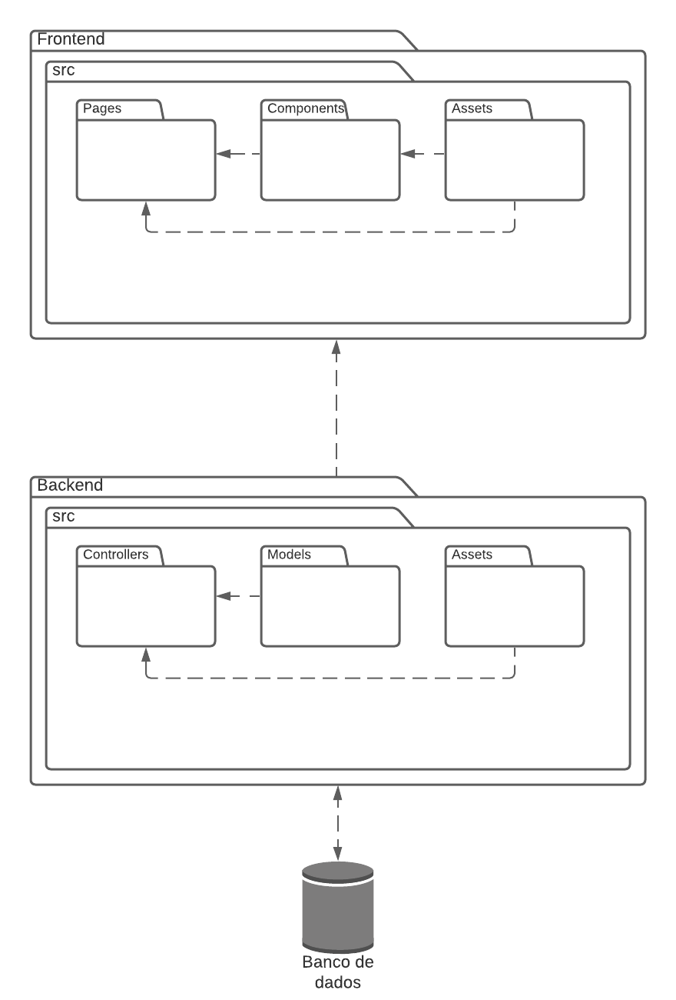

# Documento de Arquitetura de Software

## 1. Introdução

## 2. Representação Arquitetural

## 3. Metas e Restrições da Arquitetura

## 4. Visão de Casos de Uso

## 5. Visão Lógica

A Visão Lógica descreve as partes significativas de ponto de vista da arquitetura do modelo de desing, mostrando comos está organizado o conceitual do sistema em termos de camadas, pacotes, classe e interfaces.

### 5.1 Diagrama de Classes

O Diagrama de Classes representa como que as classes serão realmente programadas, os principais objetos ou as interações entre classes e objetos. O diagrama completo pode ser encontrado na parte de [Diagrama de Classes](../entrega2/diagramas_uml/diagrama_de_classe.md) na wiki do projeto.

A versão apresentada é a mais recente do projeto.

Autores: [Itallo Gravina](https://github.com/itallogravina), [Danilo Domingo](https://github.com/danilow200), [Gabrielle Ribeiro](https://github.com/Gabrielle-Ribeiro), [Gustavo Afonso](https://github.com/GustavoAPS) e [Rafael Ribeiro](https://github.com/rafaelflarrn)

### 5.2 Diagrama de Pacotes

O Diagrama de Pacotes, é um diagrama estático que possibilita a organização mais adequada do sistema representando uma visão em Pacotes. O diagrama completo pode ser encontrado na parte de [Diagrama de Pacotes](../entrega2/diagramas_uml/diagrama_de_pacotes.md) na wiki do projeto.

A versão apresentada é a mais recente do projeto.

Autor: [Danilo Domingo](https://github.com/danilow200)

### 5.3 Diagrama de Comunicação

O Diagrama de Comunicação é um diagrama que mostra interações entre objetos e/ou partes(representadas pelas lifelines) usando mensagens sequenciadas em um arranjo de forma livre. O diagrama completo pode ser encontrado na parte de [Diagrama de Comunicação](../entrega2/diagramas_uml/diagrama_de_comunicacao.md) na wiki do projeto.

A versão apresentada é a mais recente do projeto.

#### Diagrama de Comunicação Cliente

Autor: [Rafael Ribeiro](https://github.com/rafaelflarrn)
#### Diagrama de Comunicação Funcionario

.png)

Autor: [Rafael Ribeiro](https://github.com/rafaelflarrn)
## 6. Visão de Processos

## 7. Visão de Implementação

## 8. Tamanho e Desempenho

### 8.1 Visão Geral

Discrição do desempenho e das características do software que impactam na arquitetura de software.

### 8.2 Requisitos Mínimos

- É necessário possuir conexão com a internet;
- Navegador com suporte a HTML 5, CSS e JavaScript;
- Para desenvolvimento de possuir: Windows, Linux ou MacOS;

## 9. Qualidade

Qualidade de software tem como objetivo atingir requisitos especificados durante a elaboração do projeto, e as necessidades ou expectativas de usuários e clientes, esntando relacionado diretamente com: escalabilidade, manutebilidade, confiabilidade, usuabilidade e assim por diante.

### 9.1 NFR

O NFR é utilziado para rastrear os requisistos não funcionais. Seu objetivo é ajudar desenvolvedores na implementação de soluções personalizadas, levando em consideração as características do domínio e do sistema em questão, para o projeto foi criado 5 NFRs, que pode ser incontrado na parte de [Requisistos Não Funcionais](../entrega1/requisitos_nao_funcionais.md) da documentação do projeto, para que o documento não fiquei poluido será apresentando apenas o NFR de desempenho.

#### Desempenho

Autores: [Iago Theóphilo](https://github.com/IagoTheophilo), [Itallo Gravina](https://github.com/itallogravina) e [Maicon Mares](https://github.com/MaiconMares)

#### Desempenho(propagação)

.jpg)

Autores: [Iago Theóphilo](https://github.com/IagoTheophilo), [Itallo Gravina](https://github.com/itallogravina) e [Maicon Mares](https://github.com/MaiconMares)

## Versionamento

| Data | Versão | Descrição | Autor(es) |
|------|------|------|------|
|02/05/2021|1.0|Adiciona estrutura inicial do Documento de Arquitetura de Software|[Danilo Domingo](https://github.com/danilow200)|
|02/05/2021|1.1|Adiciona tamanho e desempenho|[Danilo Domingo](https://github.com/danilow200)|
|02/05/2021|1.2|Adiciona qualidade|[Danilo Domingo](https://github.com/danilow200)|
|02/05/2021|1.3|Adiciona Visão Lógica|[Danilo Domingo](https://github.com/danilow200)|