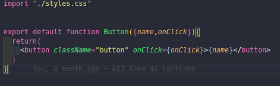
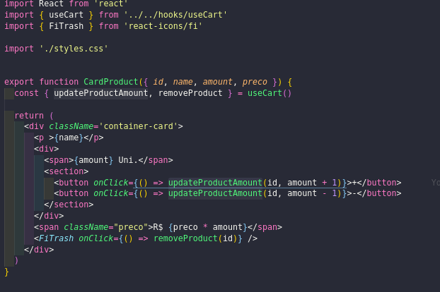
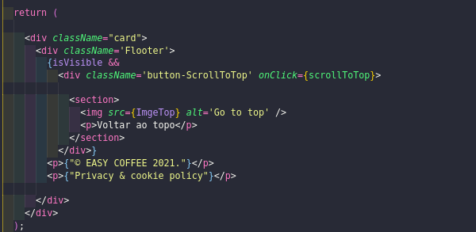
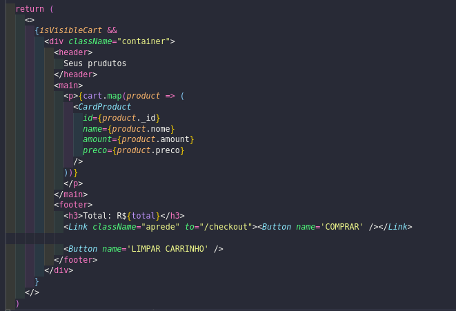
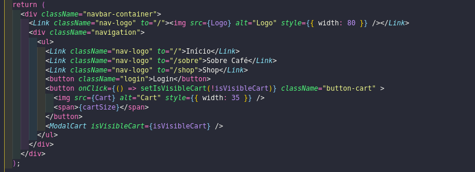
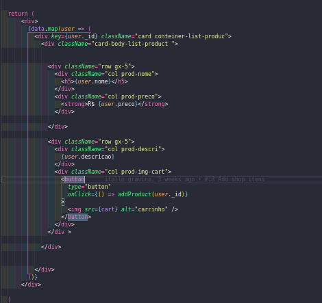
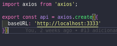
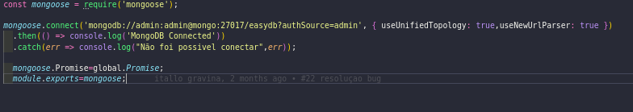
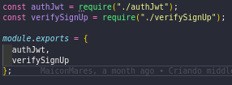
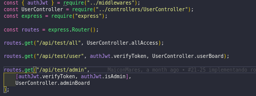

# Reutilização de Software

## Introdução
 Reutilização de software é uma estratégia de desenvolvimento que reutiliza componentes, objetos, funções, algoritmos, bibliotecas e configurações de software existentes visando tornar o desenvolvimento mais ágio e eficiente. Portanto, podemos reduzir o tempo e os custos de produção, reduzir o risco de erros no processo de desenvolvimento e manter a conformidade com os padrões mais populares, padrões previamente definidos pela organização ou equipe de desenvolvimento.

 Nos tópicos a seguir estão explicados os aspectos de como foi aplicada a reutilização, além de apontar também as possibilidades de reutilização presentes no projeto.

## Front-end

### Componentes reutilizáveis

#### Button
  Tendo em vista a reutilização de um mesmo botão na mesma aplicação, foi desenvolvido um componente que traz toda a estilização e comportamento que o butão deveria ter na aplicação. Esse componente foi usado em toda a aplicação que tinha um botão.

#### CardProduct

  Estrutura que sera reutilizada na construição dos produtos que forem adicionados ao carrinho de compra.

#### Footer

  Como na construção de cada página tem um rodapé sobre as informações da empresa. Utilizamos esse componente para na construição de cada página

#### ModalCart

Como em toda a aplicação o usuário poderá visualizar o carrinho de compras, criar um component que pode ser reutilizado em toda a aplicação é muito importante.

#### NavBar

  Na mesma ideia do fFoter o NavBar será utilizada em todas as páginas para facilidar o sistema de navegação.

#### ShopProduct

  Como na construção de todo e-commerce os cards que aparecem os produtos são padronizados é imprescindível usar um component que pode ser reutilizado

### Serviços

  O desenvolvimento da aplicação foi utilizada um arquitetura RESTfull

### Axios

Como é utilizado em toda a aplicação uma base na chamada da api, o grupo desenvolver um serviço que pode ser chamado em toda a aplicação para facilitar o consumo da API.

## Back-end

### Conexão com o MongoDB

  Esse código é reutilizavel pois ele permite fazer a conexão com o banco de dados em qualquer lugar da aplicação.

### Autenticação

  O código é reutilizado pois permite fazer a sua utilização caso precise. Foi utilizado no código para facilar a verificação da autenticidade do usuário ao tentar fazer alguns requisições no banco de dados.

## Frameworks

#### Express

  O Express é um framework para aplicativos Node.js de software livre e de código aberto sob a Licença MIT. Ele fornece um conjunto de recursos para aplicativos web e mobile que facilita a criação de APIs robustas rapidamente.

## Bibliotecas

#### React

  O React é uma biblioteca JavaScript de código aberto com foco em criar interfaces de usuário em páginas web

#### Bcrypt

  Bcrypt é uma biblioteca que ajuda a fazer hash para as senhas.

#### Nodemon

  O nodemon é uma ferramenta que ajuda no desenvolvimento de aplicativos baseados em node.js ao reiniciar automaticamente o aplicativo quando mudanças em arquivos são detectadas sem a necessidade de reiniciar o servidor. O nodemon não requer nenhuma mudança adicional no código ou método de desenvolvimento funcionando como um wrapper.

#### Axios

  Axios é uma biblioteca JavaScript útil para realizar solicitações HTTP. É baseado em  _promise_  permitindo escrever código assíncrono.

## Middlewares

#### Body-parser

  Body-parser é um Middleware que faz uma análise das solicitações recebidas antes dos manipuladores. Facilita na padronização das respostas em formato JSON da API Rest do backend.
# Referências

- Reutilização de software. Disponível em: https://www.devmedia.com.br/reutilizacao-de-software-revista-engenharia-de-software-magazine-39/21956. Último acesso em: 02/05/2021.
- Reuso de software. Disponível em: https://medium.com/@mikiasoliveira/reúso-de-software-8406766d9eb8. Último acesso em: 02/05/2021.
- Projeto RecipeBuk. Disponível em: https://www.recipebukdocs.tk/#/../06-padroes-de-arquitetura/reutilizacao-de-software. Último acesso em: 02/05/2021.

## Versionamento
| Data | Versão | Descrição | Autor(es) |
|:----:|:------:|:---------:|:---------:|
|02/05/2021|1.0| Introdução  | [Iago Theóphilo](https://github.com/iagotheophilo) |
|03/05/2021|1.0| Biblioteca, Ferramenta eMiddlewares | [Itallo Gravina](https://github.com/iitallogravina) |
|03/05/2021|1.0| Front-end | [Iago Theóphilo](https://github.com/iagotheophilo) |
|03/05/2021|1.0| Back-end | [Iago Theóphilo](https://github.com/iagotheophilo) |